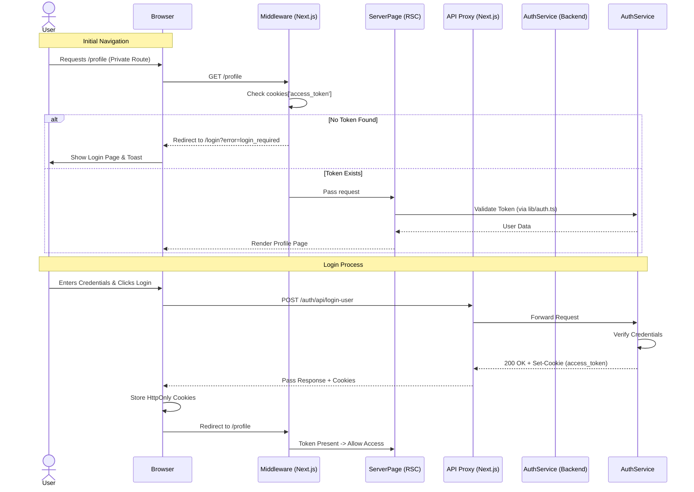

# Authentication & Route Protection Workflow

This document outlines how user authentication, route protection, and session management work in the `Artistry Cart` application.

## Overview

The application uses a **cookie-based authentication** system.
*   **Tokens**: JWTs (`access_token`, `refresh_token`) are stored in `HttpOnly` cookies.
*   **Protection**: 
    *   **Global Middleware**: Intercepts requests at the edge to protect private routes.
    *   **API Gateway**: Proxies requests to ensure cookies are correctly scoped.
    *   **Axios Interceptors**: Handles token refreshing silently on the client.

## Sequence Diagram

## Key Components

### 1. Middleware (`apps/user-ui/src/middleware.ts`)
*   **Role**: The first line of defense.
*   **Logic**:
    *   Intercepts every request (except static assets).
    *   Checks for `access_token` cookie.
    *   **Private Routes** (`/profile`, `/checkout`): Redirects to `/login` if no token.
    *   **Auth Routes** (`/login`, `/signup`): Redirects to `/profile` if token exists.

### 2. Next.js Proxy (`next.config.js`)
*   **Problem**: Cookies set by the backend (port 4000/6001) might not be visible to the frontend (port 3000) due to domain/port mismatch locally.
*   **Solution**: We use `rewrites()` to proxy `/auth/api/*` checks through the Next.js server.
*   **Result**: The browser sees the cookie coming from `localhost:3000`, so it attaches it to subsequent frontend requests.

### 3. Server Authentication (`src/lib/auth.ts`)
*   **Role**: Verifies identity within React Server Components.
*   **Logic**:
    *   Reads `access_token` from cookies.
    *   Verifies JWT signature using `ACCESS_TOKEN_SECRET`.
    *   Fetches user details from Prisma.

### 4. Client Interceptors (`src/utils/axiosinstance.ts`)
*   **Role**: Handles Token Refreshing.
*   **Logic**:
    *   Intercepts 401 Unauthorized responses.
    *   Calls `/auth/api/refresh-token` to get a new `access_token`.
    *   Retries the original failed request seamlessly.
