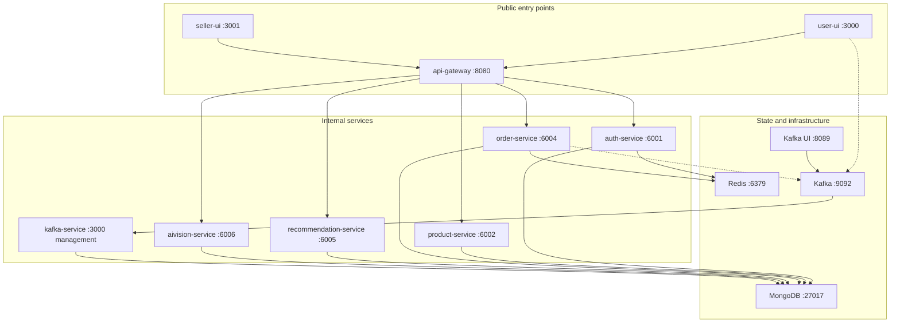
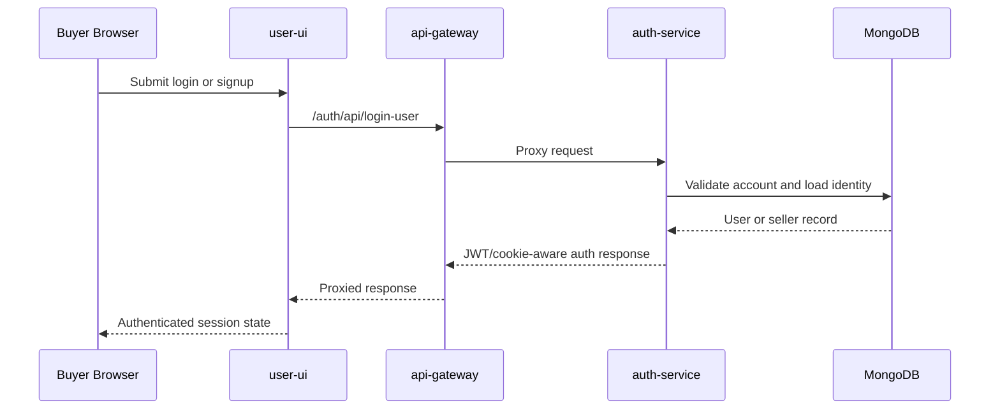
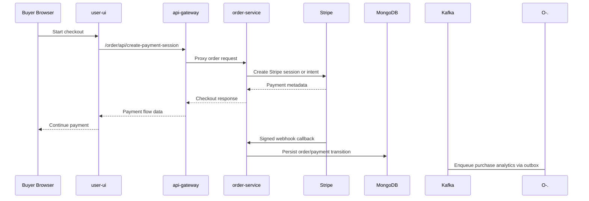
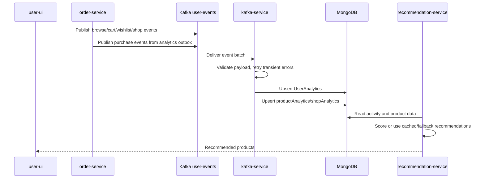
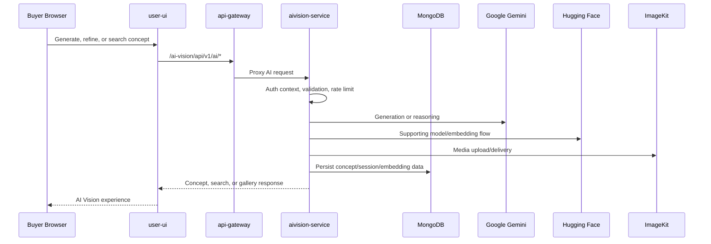
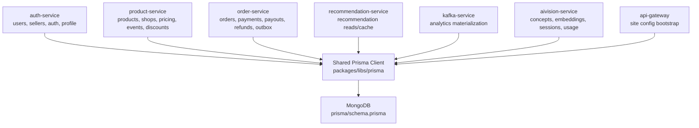
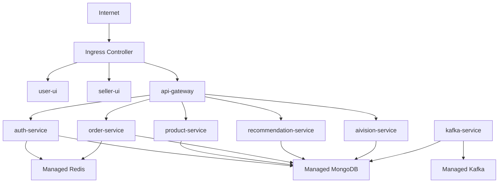

# Artistry Cart


Artistry Cart is a production-oriented, service-based ecommerce platform for artisan commerce. It combines a buyer marketplace, a seller operations dashboard, API gateway routing, domain-focused backend services, MongoDB persistence through Prisma, Kafka-backed analytics, Stripe payments, Redis-assisted runtime behavior, and a dedicated AI Vision service for generation, visual search, and artisan collaboration.

The repository is intentionally built as an Nx monorepo: one workspace, multiple deployable applications, shared infrastructure packages, unified testing, Docker/Kubernetes assets, and a canonical documentation system under [`docs/`](docs/README.md).

## Table Of Contents

- [Product Scope](#product-scope)
- [Architecture Overview](#architecture-overview)
- [Applications And Services](#applications-and-services)
- [Request, Event, And Data Flows](#request-event-and-data-flows)
- [Technology Stack](#technology-stack)
- [Repository Map](#repository-map)
- [Local Development](#local-development)
- [Environment Variables](#environment-variables)
- [Ports](#ports)
- [Testing](#testing)
- [Docker, Kubernetes, And Delivery](#docker-kubernetes-and-delivery)
- [Observability And Security](#observability-and-security)
- [Production Readiness Notes](#production-readiness-notes)
- [Documentation Guide](#documentation-guide)

## Product Scope

Artistry Cart supports three major experience areas:

| Area | What It Provides |
| --- | --- |
| Buyer marketplace | Landing pages, catalog browsing, product detail pages, search, shops, artisans, events, cart, wishlist, checkout, profile, order history, and support pages. |
| Seller operations | Seller auth, onboarding, shop setup, dashboard navigation, product management, order review, discounts, offers, event management, and operational workflows. |
| Platform intelligence | Auth, OAuth, payments, analytics ingestion, recommendation serving, AI concept generation, visual search, collections, comments, artisan matching, and scheduled AI maintenance jobs. |

The platform is more than a CRUD storefront. Its interesting engineering surface comes from combining commerce, payments, personalization, AI workflows, async analytics, deployment automation, and operational hardening inside one coherent workspace.

## Architecture Overview

Artistry Cart uses a pragmatic hybrid architecture:

- Nx and pnpm keep all source, tests, shared packages, and infrastructure definitions in one monorepo.
- Next.js powers the buyer and seller frontends.
- Express services own major backend domains.
- The API gateway is the client-facing backend entry point and routes traffic to internal services.
- MongoDB is the durable system of record through a shared Prisma client.
- Kafka carries user activity events into analytics read models.
- Redis supports selected fast-path or auxiliary behavior with graceful fallback.
- AI Vision is isolated from transactional commerce services because it has heavier dependencies, different latency behavior, and scheduled background jobs.


### Service Topology



## Applications And Services

| Project | Type | Port | Responsibility |
| --- | --- | ---: | --- |
| [`apps/user-ui`](apps/user-ui) | Next.js app | `3000` | Buyer marketplace, catalog, checkout, profile, search, shops, support, artisans, and AI Vision UX. |
| [`apps/seller-ui`](apps/seller-ui) | Next.js app | `3001` | Seller auth, onboarding, dashboard, products, events, discounts, offers, and orders. |
| [`apps/api-gateway`](apps/api-gateway) | Express service | `8080` | Public backend entry point, CORS, rate limiting, request parsing, health, metrics, and proxy routing. |
| [`apps/auth-service`](apps/auth-service) | Express service | `6001` | Buyer/seller auth, JWTs, OAuth, profile, addresses, seller onboarding, shop creation, and Stripe onboarding links. |
| [`apps/product-service`](apps/product-service) | Express service | `6002` | Products, shops, search, categories, images, pricing, discounts, events, offers, and catalog cleanup. |
| [`apps/order-service`](apps/order-service) | Express service | `6004` | Checkout, Stripe sessions/intents, webhooks, orders, cancellations, refunds, seller orders, earnings, payouts, and purchase analytics outbox. |
| [`apps/recommendation-service`](apps/recommendation-service) | Express service | `6005` | Recommendation APIs backed by materialized user activity and TensorFlow-based scoring/fallback logic. |
| [`apps/aivision-service`](apps/aivision-service) | Express service | `6006` | Text/image generation, product variations, visual search, concepts, gallery, collections, comments, artisan matching, embeddings, rate limiting, and Agenda jobs. |
| [`apps/kafka-service`](apps/kafka-service) | Worker + HTTP management | `3000` | Kafka consumer for `user-events`, analytics materialization, retry/DLQ behavior, readiness, and Prometheus-style metrics. |

### Shared Packages

| Package | Purpose |
| --- | --- |
| [`packages/error-handler`](packages/error-handler) | Shared Express error classes and middleware for normalized application, Prisma, validation, auth, and unexpected errors. |
| [`packages/middleware`](packages/middleware) | Shared JWT auth, role guards, seller/user/admin authorization helpers, and identity hydration. |
| [`packages/libs`](packages/libs) | Prisma client, Redis initialization, and ImageKit integration entry points. |
| [`packages/utils`](packages/utils) | Kafka client utilities plus shared runtime helpers for logging, CORS, health, metrics, request IDs, security headers, service URLs, and shutdown. |
| [`packages/test-utils`](packages/test-utils) | Test helpers, mocks, auth utilities, data factories, request helpers, and shared setup. |

## Request, Event, And Data Flows

### Gateway Routing

The frontends see one backend entry point. The gateway keeps routing centralized and forwards requests to domain services.

| Gateway Prefix | Upstream Service | Typical Base Path |
| --- | --- | --- |
| `/auth` | `auth-service` | `/auth/api/*` |
| `/product` | `product-service` | `/product/api/*` |
| `/order` | `order-service` | `/order/api/*` |
| `/recommendation` | `recommendation-service` | `/recommendation/api/*` |
| `/ai-vision` | `aivision-service` | `/ai-vision/api/v1/ai/*` |

Gateway upstreams are environment-driven through `AUTH_SERVICE_URL`, `PRODUCT_SERVICE_URL`, `ORDER_SERVICE_URL`, `RECOMMENDATION_SERVICE_URL`, and `AIVISION_SERVICE_URL`, with local defaults matching the standard ports.

### Buyer Auth Flow



### Checkout And Payment Flow



Stripe webhook parsing is mounted before JSON body parsing in `order-service`, which preserves the raw request body required for signature verification.

### Analytics And Recommendation Flow



The worker uses manual offset commits, validates messages before persistence, supports bounded retry, and can dead-letter invalid or exhausted events when `KAFKA_DLQ_TOPIC` is configured.

### AI Vision Flow



AI Vision supports anonymous exploration for selected paths while still allowing stricter authenticated routes through local `requireAuth` behavior.

### Data Ownership Model

The repository is service-oriented at the application boundary, but persistence is centralized. Services express ownership logically through code, APIs, and documentation while sharing one MongoDB schema and Prisma client.



Major model clusters in [`prisma/schema.prisma`](prisma/schema.prisma):

- Identity: `users`, `sellers`, `addresses`, `Notification`
- Shops: `shops`, `shopReviews`, `site_config`
- Catalog: `products`, `ProductPricing`, `events`, `EventProductDiscount`, `discount_codes`, `discount_usage`, `banners`
- Orders: `orders`, `OrderItem`, `payments`, `payouts`, `refunds`
- Analytics: `UserAnalytics`, `productAnalytics`, `shopAnalytics`, `uniqueShopVisitor`, `analyticsOutbox`
- AI Vision: `VisionSession`, `Concept`, `ConceptImage`, `AIGeneratedProduct`, `ArtisanMatch`, `ConceptCollection`, `ConceptComment`, `RateLimitEntry`, `ProductEmbedding`, `APIUsageLog`

## Technology Stack

| Layer | Technologies |
| --- | --- |
| Monorepo | Nx 21, pnpm workspace, TypeScript |
| Frontend | Next.js 15, React 19, Tailwind CSS 4, React Query, Zustand, Jotai, GSAP, Framer Motion, Radix UI, Lucide |
| Backend | Express, Node.js 20, Zod, cookie-parser, CORS, express-rate-limit |
| Data | MongoDB, Prisma, Redis |
| Events | Kafka, KafkaJS, Kafka UI, DLQ-capable analytics worker |
| Payments | Stripe client/server SDKs and signed webhooks |
| AI and media | Google Gemini, Hugging Face, TensorFlow.js, LangChain, ImageKit |
| Testing | Vitest, Supertest, Nx e2e projects, shared mocks and factories |
| Delivery | Docker, Docker Compose, GitHub Actions, GHCR, Kustomize, Kubernetes |
| Operations | `/healthz`, `/readyz`, `/metrics`, structured logs, request IDs, Trivy scans, SBOM/provenance, Dependabot |

## Repository Map

```text
.
+-- apps/
|   +-- user-ui/                    # Buyer-facing Next.js app
|   +-- seller-ui/                  # Seller dashboard Next.js app
|   +-- api-gateway/                # Public backend proxy/edge service
|   +-- auth-service/               # Identity, OAuth, onboarding
|   +-- product-service/            # Catalog, shops, search, discounts, events
|   +-- order-service/              # Checkout, orders, Stripe, payouts
|   +-- recommendation-service/     # Recommendation APIs
|   +-- aivision-service/           # AI generation, visual search, concepts
|   +-- kafka-service/              # Analytics worker
|   +-- *-e2e/                      # Service-level e2e projects
+-- packages/
|   +-- error-handler/              # Shared Express error contract
|   +-- middleware/                 # Shared auth/role middleware
|   +-- libs/                       # Prisma, Redis, ImageKit helpers
|   +-- utils/                      # Kafka and runtime utilities
|   +-- test-utils/                 # Shared test helpers and mocks
+-- prisma/
|   +-- schema.prisma               # MongoDB schema
|   +-- seed/                       # Seed fixtures and scripts
+-- docker/
|   +-- backend.Dockerfile
|   +-- frontend.Dockerfile
|   +-- compose/                    # Infra, apps, and full-stack Compose files
+-- k8s/
|   +-- base/                       # Kustomize base manifests
|   +-- overlays/                   # dev, staging, production overlays
|   +-- addons/monitoring/          # Optional Prometheus Operator resources
+-- scripts/ci/                     # Release and deployment helper scripts
+-- tools/e2e/                      # E2E orchestration helper
+-- docs/                           # Canonical documentation system
+-- .github/workflows/              # CI, publish, deploy, security workflows
```

## Local Development

### Prerequisites

- Node.js `20` as declared in [`.nvmrc`](.nvmrc)
- pnpm `9`
- MongoDB
- Redis
- Docker, if using Compose or local Kafka

### Install

```bash
pnpm install
pnpm exec prisma generate
```

### Prepare Environment

Start from [`.env.example`](.env.example):

```bash
cp .env.example .env
```

For Windows PowerShell:

```powershell
Copy-Item .env.example .env
```

At minimum, most local backend flows need:

- `DATABASE_URL`
- `FRONTEND_URL`
- `CORS_ALLOWED_ORIGINS`
- `ACCESS_TOKEN_SECRET`
- `REFRESH_TOKEN_SECRET`
- `NEXT_PUBLIC_SERVER_URI`
- service URL variables such as `AUTH_SERVICE_URL` and `PRODUCT_SERVICE_URL`

Feature-specific flows require additional Stripe, SMTP, OAuth, ImageKit, Gemini, Hugging Face, Kafka, and Redis variables.

### Option 1: Full Docker Compose Stack

The canonical full-stack Compose entry point is:

```bash
docker compose -f docker/compose/docker-compose.full.yml up --build
```

Infra only:

```bash
docker compose -f docker/compose/docker-compose.infra.yml up -d
```

Apps only:

```bash
docker compose -f docker/compose/docker-compose.apps.yml up --build
```

### Option 2: Manual Service Startup

Start infrastructure first:

```bash
docker compose -f libs/docker-compose.yml up -d
```

That starts Zookeeper, Kafka, and Kafka UI. MongoDB and Redis can be started locally or through the Compose infra stack.

Recommended manual order:

1. MongoDB
2. Redis
3. Kafka infrastructure
4. `auth-service`
5. `product-service`
6. `order-service`
7. `recommendation-service`
8. `aivision-service`
9. `kafka-service`
10. `api-gateway`
11. `user-ui`
12. `seller-ui`

Backend services:

```bash
pnpm exec nx serve auth-service
pnpm exec nx serve product-service
pnpm exec nx serve order-service
pnpm exec nx serve recommendation-service
pnpm exec nx serve aivision-service
pnpm exec nx serve kafka-service
pnpm exec nx serve api-gateway
```

Frontend apps:

```bash
pnpm exec nx dev user-ui
pnpm exec nx dev seller-ui
```

Shortcut scripts:

```bash
pnpm user-ui
pnpm seller-ui
```

### Common Root Commands

| Command | Purpose |
| --- | --- |
| `pnpm dev` | Run Nx `serve` across all projects. Useful but noisy for the full monorepo. |
| `pnpm user-ui` | Start the buyer UI in dev mode. |
| `pnpm seller-ui` | Start the seller UI in dev mode. |
| `pnpm run build:shared` | Build shared workspace packages used by tests and services. |
| `pnpm test` | Build shared packages, then run the root Vitest workspace. |
| `pnpm test:coverage` | Run coverage through the root Vitest workspace. |
| `pnpm test:e2e:infra:up` | Start MongoDB and Redis test infrastructure. |
| `pnpm test:e2e:core` | Run core backend e2e suites. |
| `pnpm test:e2e:all` | Run all e2e suites, including AI Vision and Kafka. |

## Environment Variables

The full inventory lives in [`docs/01-getting-started/environment-variables.md`](docs/01-getting-started/environment-variables.md). The most important groups are:

| Group | Variables |
| --- | --- |
| Runtime | `NODE_ENV`, `HOST`, `PORT`, `LOG_LEVEL`, `CORS_ALLOWED_ORIGINS`, `FRONTEND_URL` |
| Gateway upstreams | `AUTH_SERVICE_URL`, `PRODUCT_SERVICE_URL`, `ORDER_SERVICE_URL`, `RECOMMENDATION_SERVICE_URL`, `AIVISION_SERVICE_URL` |
| Frontend public config | `NEXT_PUBLIC_SERVER_URI`, `INTERNAL_SERVER_URI`, `NEXT_PUBLIC_FRONTEND_URL`, `NEXT_PUBLIC_USER_UI_LINK`, `NEXT_PUBLIC_AI_VISION_API_URL` |
| Database/cache | `DATABASE_URL`, `REDIS_ENABLED`, `REDIS_URL` |
| Auth | `ACCESS_TOKEN_SECRET`, `REFRESH_TOKEN_SECRET`, `MAINTENANCE_TOKEN` |
| OAuth | `GOOGLE_CLIENT_ID`, `GOOGLE_CLIENT_SECRET`, `GITHUB_CLIENT_ID`, `GITHUB_CLIENT_SECRET`, `FACEBOOK_CLIENT_ID`, `FACEBOOK_CLIENT_SECRET`, `OAUTH_REDIRECT_BASE_URL` |
| Kafka | `KAFKA_BROKERS`, `KAFKA_CLIENT_ID`, `KAFKA_USER_EVENTS_TOPIC`, `KAFKA_DLQ_TOPIC`, retry/batch/fetch controls |
| Payments | `STRIPE_SECRETE_KEY`, `STRIPE_WEBHOOK_SECRET`, `NEXT_PUBLIC_STRIPE_PUBLIC_KEY` |
| Email | `SMTP_HOST`, `SMTP_PORT`, `SMTP_SERVICE`, `SMTP_USER`, `SMTP_PASS` |
| AI/media | `GOOGLE_API_KEY`, `HUGGINGFACE_API_KEY`, `IMAGEKIT_PUBLIC_API_KEY`, `IMAGEKIT_PRIVATE_API_KEY`, `IMAGEKIT_URL_ENDPOINT` |

Note the current Stripe secret variable is intentionally documented as `STRIPE_SECRETE_KEY` because that spelling is used by the codebase.

## Ports

| Port | Component | Notes |
| ---: | --- | --- |
| `3000` | `user-ui` | Buyer app |
| `3001` | `seller-ui` | Seller dashboard |
| `6001` | `auth-service` | Auth, registration, OAuth |
| `6002` | `product-service` | Catalog, shops, search, discounts, events, offers |
| `6004` | `order-service` | Orders, payments, webhooks |
| `6005` | `recommendation-service` | Recommendations |
| `6006` | `aivision-service` | AI Vision API |
| `8080` | `api-gateway` | Public backend entry point |
| `8089` | Kafka UI | Local Kafka inspection |
| `9092` | Kafka | Broker |
| `2181` | Zookeeper | Local Kafka dependency |
| `6379` | Redis | Cache/auxiliary runtime |
| `27017` | MongoDB | Primary database |

See [`docs/11-reference/port-map.md`](docs/11-reference/port-map.md) for the canonical reference.

## Testing

The repo uses layered testing:

- Unit and integration tests through Vitest.
- Service-level e2e projects under `apps/*-e2e`.
- Shared mocks, factories, request helpers, and setup through `packages/test-utils`.
- GitHub Actions validation for affected tests/builds, coverage, selected e2e flows, image builds, scans, and deployments.

### Root Test Workspace

The root [`vitest.config.mjs`](vitest.config.mjs) currently includes:

- `apps/kafka-service`
- `apps/product-service`
- `apps/auth-service`
- `apps/order-service`
- `apps/api-gateway`
- `apps/recommendation-service`
- `packages/middleware`
- `packages/error-handler`

Run all configured unit/integration tests:

```bash
pnpm test
```

Focused suites:

```bash
pnpm test:auth
pnpm test:product
pnpm test:order
pnpm test:gateway
pnpm test:recommendation
pnpm test:kafka
pnpm test:middleware
pnpm test:error-handler
```

Coverage:

```bash
pnpm test:coverage
```

### E2E Suites

The e2e runner can start required services and run suite groups:

```bash
pnpm test:e2e:infra:up
pnpm test:e2e:core
pnpm test:e2e:all
pnpm test:e2e:infra:down
```

Core e2e suites cover auth, product, order, recommendation, and gateway flows. The `all` group also includes AI Vision and Kafka e2e projects.

## Docker, Kubernetes, And Delivery

### Containerization

The repository includes:

- [`docker/backend.Dockerfile`](docker/backend.Dockerfile)
- [`docker/frontend.Dockerfile`](docker/frontend.Dockerfile)
- [`docker/compose/docker-compose.infra.yml`](docker/compose/docker-compose.infra.yml)
- [`docker/compose/docker-compose.apps.yml`](docker/compose/docker-compose.apps.yml)
- [`docker/compose/docker-compose.full.yml`](docker/compose/docker-compose.full.yml)
- [`docker-compose.test.yml`](docker-compose.test.yml)

The Compose design separates infra, apps, and full-stack startup so local workflows can be as small or complete as needed.

### Kubernetes Topology

The Kubernetes baseline uses Kustomize:

```text
k8s/
+-- base/
+-- overlays/
|   +-- dev/
|   +-- staging/
|   +-- production/
+-- addons/monitoring/
```



Only `user-ui`, `seller-ui`, and `api-gateway` are intended to be public. Internal services stay behind `ClusterIP` services. Stateful production infrastructure is expected to be managed outside the app cluster.

Apply an overlay:

```bash
kubectl apply -k k8s/overlays/dev
```

Optional monitoring add-on:

```bash
kubectl apply -k k8s/addons/monitoring/overlays/dev
```

### CI/CD Flow

The repository includes five GitHub Actions workflows:

| Workflow | Purpose |
| --- | --- |
| [`.github/workflows/test.yml`](.github/workflows/test.yml) | PR/default-branch validation, affected tests/builds, coverage, and core e2e. |
| [`.github/workflows/build-publish.yml`](.github/workflows/build-publish.yml) | Build deployable workloads, publish images to GHCR, generate image manifest, scan images, and attach SBOM/provenance. |
| [`.github/workflows/deploy-staging.yml`](.github/workflows/deploy-staging.yml) | Promote exact image digests into staging with Kustomize. |
| [`.github/workflows/deploy-production.yml`](.github/workflows/deploy-production.yml) | Controlled production promotion using published image digests. |
| [`.github/workflows/nightly-security.yml`](.github/workflows/nightly-security.yml) | Scheduled filesystem scanning and dependency audit. |

```mermaid
flowchart LR
    PR["Pull Request"] --> Install["Install + prisma generate"]
    Install --> Affected["Nx affected test/build"]
    Affected --> Merge["Merge to master"]

    Merge --> Coverage["Coverage + deployable builds"]
    Coverage --> Images["Build Docker images"]
    Images --> Scan["Trivy scan + SBOM/provenance"]
    Scan --> GHCR["Publish to GHCR"]
    GHCR --> Manifest["Release image manifest"]
    Manifest --> Staging["Deploy staging overlay"]
    Staging --> Smoke["Smoke checks"]
    Smoke --> Approval["Production approval"]
    Approval --> Prod["Deploy production overlay"]
```



## Observability And Security

### Observability Baseline

The shared runtime utilities in [`packages/utils/runtime`](packages/utils/runtime/index.ts) provide:

- structured logging with production JSON output
- `x-request-id` generation and propagation
- request completion logs
- Prometheus-compatible `/metrics`
- process uptime and HTTP request metrics
- standardized `/healthz` and `/readyz`
- graceful shutdown helpers

`kafka-service` adds worker metrics for processing, parse failures, readiness state, and management endpoints.

### Security Baseline

Current safeguards include:

- JWT verification and account hydration through shared middleware.
- Seller/user/admin role guards.
- OAuth state and PKCE-aware provider flows through Arctic.
- Stripe webhook signature verification with raw body parsing.
- Gateway rate limiting through environment-driven limits.
- AI Vision route-level rate limiting.
- Baseline browser and Express security headers.
- Kubernetes non-root execution, dropped capabilities, disabled privilege escalation, runtime-default seccomp, PDB/HPA manifests, and baseline NetworkPolicy resources.
- Trivy image/filesystem scans, SBOM/provenance generation, Dependabot, and scheduled security workflow.

## Production Readiness Notes

The project has a real production-grade foundation, but the README is intentionally candid about remaining maturity work.

### Strong Signals

- Clear app and service boundaries.
- Buyer and seller frontends are separated by persona.
- Orders and AI workloads are isolated from core catalog logic.
- Kafka analytics keeps user-facing interactions off the analytics write path.
- Shared runtime utilities standardize health, readiness, metrics, logging, CORS, security headers, and shutdown.
- Shared test utilities reduce duplicated mocking and setup.
- Docker Compose, Dockerfiles, Kustomize overlays, CI, image publishing, scanning, and deployment workflows are present.

### Known Tradeoffs And Risks

- Persistence is shared through one MongoDB schema and Prisma client, so service independence is logical rather than fully physical.
- `product-service` owns a broad catalog, search, pricing, discount, event, offer, and shop surface; this is convenient but high-blast-radius.
- Recommendation scoring still happens in the request path with caching/fallbacks rather than a fully offline model-serving pipeline.
- `aivision-service` combines API routes and Agenda jobs; long-term production scaling may split API and worker roles.
- Secrets management is environment/Kubernetes-secret based today; external secret management and rotation workflows are future hardening items.
- Validation is strongest in AI Vision and less uniform across all backend services.
- Frontend automated test coverage is not as visible as backend service coverage.

## Documentation Guide

The canonical documentation starts at [`docs/README.md`](docs/README.md).

Recommended reading path:

1. [`docs/00-overview/product-overview.md`](docs/00-overview/product-overview.md)
2. [`docs/00-overview/business-context.md`](docs/00-overview/business-context.md)
3. [`docs/00-overview/repo-map.md`](docs/00-overview/repo-map.md)
4. [`docs/01-getting-started/local-development.md`](docs/01-getting-started/local-development.md)
5. [`docs/01-getting-started/environment-variables.md`](docs/01-getting-started/environment-variables.md)
6. [`docs/02-architecture/system-overview.md`](docs/02-architecture/system-overview.md)
7. [`docs/02-architecture/service-topology.md`](docs/02-architecture/service-topology.md)
8. [`docs/02-architecture/request-flows.md`](docs/02-architecture/request-flows.md)
9. [`docs/02-architecture/event-flows.md`](docs/02-architecture/event-flows.md)
10. [`docs/02-architecture/data-architecture.md`](docs/02-architecture/data-architecture.md)
11. [`docs/07-quality-and-operations/testing-strategy.md`](docs/07-quality-and-operations/testing-strategy.md)
12. [`docs/07-quality-and-operations/ci-cd.md`](docs/07-quality-and-operations/ci-cd.md)
13. [`docs/DevOps/kubernetes-deployment-guide.md`](docs/DevOps/kubernetes-deployment-guide.md)

Architecture decisions are captured under [`docs/08-decisions`](docs/08-decisions):

- [ADR-001: Monorepo And Nx](docs/08-decisions/adr-001-monorepo-and-nx.md)
- [ADR-002: MongoDB With Prisma](docs/08-decisions/adr-002-mongodb-with-prisma.md)
- [ADR-003: API Gateway Pattern](docs/08-decisions/adr-003-api-gateway-pattern.md)
- [ADR-004: Kafka Analytics Pipeline](docs/08-decisions/adr-004-kafka-analytics-pipeline.md)
- [ADR-005: AI Vision Service Boundary](docs/08-decisions/adr-005-ai-vision-service-boundary.md)

For interview-style system design prep, see [`docs/09-interview-prep`](docs/09-interview-prep) and the learning path under [`docs/learn`](docs/learn/README.md).
