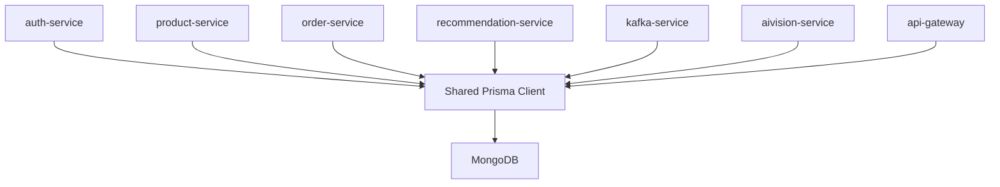

# Data Architecture

## Summary

The platform uses MongoDB as its primary data store with Prisma as the shared access layer. Data ownership is expressed mostly through logical service boundaries and model conventions rather than physically separate databases per service.

This is one of the most important architectural truths in the repository: the codebase looks service-oriented, but persistence is still largely centralized.

## Primary Data Strategy

- database: MongoDB
- access layer: Prisma Client
- shared client package: `packages/libs/prisma`
- schema location: `prisma/schema.prisma`

Prisma client creation is centralized in a shared package and reused across services. In non-production mode the client is cached on `globalThis`, which is a pragmatic local-development optimization.

## Major Data Domains

The Prisma schema spans several business domains:

- users, sellers, shops, addresses
- products and product pricing history
- events and event-specific product discounts
- orders, order items, payments, payouts
- discount codes and discount usage
- analytics models such as `UserAnalytics` and `productAnalytics`
- AI Vision-specific entities such as concepts, collections, comments, embeddings, sessions, and rate limits

## Logical Ownership By Service

This is the practical ownership model suggested by the codebase:

| Service | Primary data it appears to own |
| --- | --- |
| `auth-service` | users, sellers, shops during onboarding, addresses, profile-related reads |
| `product-service` | products, shops, events, discounts, offers, price history |
| `order-service` | orders, order items, payments, payouts, refund-related transitions |
| `recommendation-service` | reads `UserAnalytics` and product data to produce recommendations |
| `kafka-service` | writes `UserAnalytics` and `productAnalytics` |
| `aivision-service` | AI Vision concepts, collections, comments, embeddings, sessions, rate-limit entries, usage logs |
| `api-gateway` | site configuration bootstrap on startup |

This is logical ownership, not hard storage isolation.

## Data Architecture Diagram

## Important Modeling Patterns

### Document-oriented flexibility

The schema uses MongoDB-friendly structures such as:

- JSON fields for images, avatars, custom properties, social links, and analytics payloads
- array-heavy fields for tags, colors, sizes, and recommendations
- embedded-ish flexible structures via `Json` and `Json[]`

This allows fast iteration on product and AI feature models without the rigidity of a heavily normalized relational schema.

### Denormalized analytics

Analytics models such as `UserAnalytics` and `productAnalytics` are materialized separately from transactional records. This supports:

- faster recommendation reads
- cheaper counter-style analytics updates
- asynchronous behavioral processing

### Pricing and promotions as first-class data

The product domain includes:

- base and current pricing fields
- product pricing history
- discount code entities
- event-specific discount entities

This is a meaningful architectural signal: pricing is not a single field, it is a domain with history and layered rules.

## Data Boundary Reality

The current data architecture has a mixed character:

- good logical separation of concerns at the code and service level
- weaker physical separation at the storage level because services share one schema and one database

That tradeoff is common in growing platforms. It improves speed of development and reduces infrastructure sprawl, but it also means:

- cross-service schema changes need discipline
- write ownership can become ambiguous
- true independent deployment and storage evolution are harder later

## Redis In The Data Story

Redis is not the primary source of truth. It acts as auxiliary infrastructure and is intentionally designed to fail gracefully when disabled or unavailable.

That means:

- MongoDB remains the durable system of record
- Redis-backed features may degrade rather than taking the platform down completely

## Data Risks To Call Out Honestly

- shared schema means service isolation is weaker than the folder layout alone suggests
- JSON-heavy modeling increases flexibility but can reduce strict contract enforcement
- analytics and recommendation records can drift from source-of-truth transactional data if event processing fails
- some entities may have multi-service touch points, which raises coordination complexity

## Related Docs

- [System Overview](</C:/Users/adity/Desktop/Artistry Cart/artistry-cart/docs/02-architecture/system-overview.md>)
- [Tradeoffs](</C:/Users/adity/Desktop/Artistry Cart/artistry-cart/docs/02-architecture/tradeoffs.md>)
