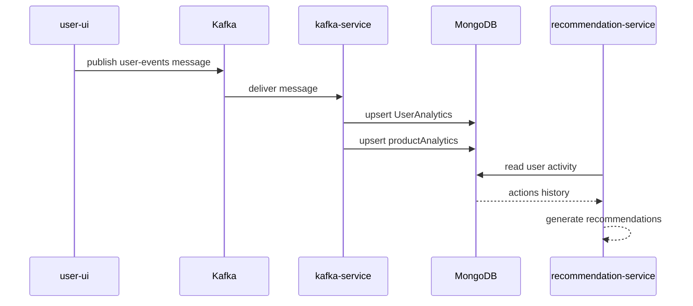
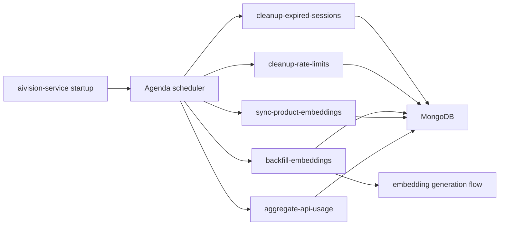

# Event Flows

## Purpose

This document explains the asynchronous flows in the system. These flows are especially important because they capture how Artistry Cart avoids putting every computation on the foreground request path.

## Flow 1: User Activity To Analytics Materialization

The clearest asynchronous pipeline in the repository is the analytics path used to support recommendations and product analytics.

### End-to-end path

1. a buyer interaction occurs in `user-ui`
2. a server action publishes an event to Kafka using the shared Kafka producer
3. the event is written to the `user-events` topic
4. `kafka-service` consumes events in batches
5. the worker validates event type and updates analytics state in MongoDB through Prisma
6. `recommendation-service` later reads `UserAnalytics.actions` to generate recommendations

### Diagram

### What gets materialized

The worker currently updates:

- `UserAnalytics`
  - action history
  - last visited timestamp
  - optional location/device metadata

- `productAnalytics`
  - views
  - cart adds
  - wishlist adds
  - purchases

### Why this matters

This pattern keeps recommendation inputs and analytics counters out of the buyer’s main request latency budget.

## Flow 2: Recommendation Generation

Recommendation generation is not itself Kafka-based in the current implementation. It is asynchronous in the sense that it relies on previously materialized behavioral data.

### Path

1. user activity is captured asynchronously by the Kafka pipeline
2. recommendation request arrives at `recommendation-service`
3. service fetches user actions from `UserAnalytics`
4. service preprocesses activity with available product data
5. TensorFlow-based recommendation logic trains or scores in-process
6. top recommendations are returned synchronously to the caller

### Architectural implication

The system uses asynchronous data capture but synchronous recommendation serving. That is simpler than a fully offline recommendation pipeline, but it means recommendation API latency and model cost are still tied to request time.

## Flow 3: AI Vision Background Jobs

`aivision-service` runs recurring background jobs through Agenda.

### Current scheduled jobs

- cleanup expired sessions
- cleanup rate limit entries
- backfill missing concept image embeddings
- sync product embeddings
- aggregate API usage

### Diagram

### Why this matters

This keeps maintenance, indexing, and cleanup work separate from interactive requests and lets the AI service gradually improve search or embedding coverage over time.

## Flow 4: Stripe Webhooks

Stripe webhooks are asynchronous external callbacks rather than internal event-bus messages, but they still belong in the event-driven architecture story.

### Path

1. checkout or payment state changes inside Stripe
2. Stripe sends a webhook to `order-service`
3. `order-service` verifies the webhook signature
4. event-specific handlers update order, payment, refund, or payout-related state

### Why this matters

The order service is not allowed to assume foreground payment calls are the only source of truth. Final payment state is confirmed asynchronously through Stripe webhook delivery.

## Current Strengths

- analytics writes do not block buyer interactions
- product analytics are materialized centrally
- AI Vision maintenance work is decoupled from request handlers
- payment finalization respects external callback semantics

## Current Constraints

- Kafka usage appears focused on analytics rather than broad cross-service domain events
- recommendation serving still performs compute in the request path
- event schema governance is lightweight and code-driven rather than contract-driven
- there is no dedicated observability layer for event lag, dead-letter handling, or retry policy documentation yet

## Related Docs

- [Request Flows](</C:/Users/adity/Desktop/Artistry Cart/artistry-cart/docs/02-architecture/request-flows.md>)
- [Tradeoffs](</C:/Users/adity/Desktop/Artistry Cart/artistry-cart/docs/02-architecture/tradeoffs.md>)
