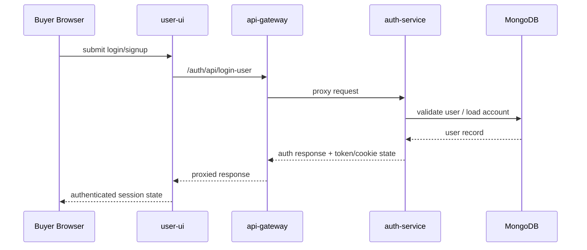
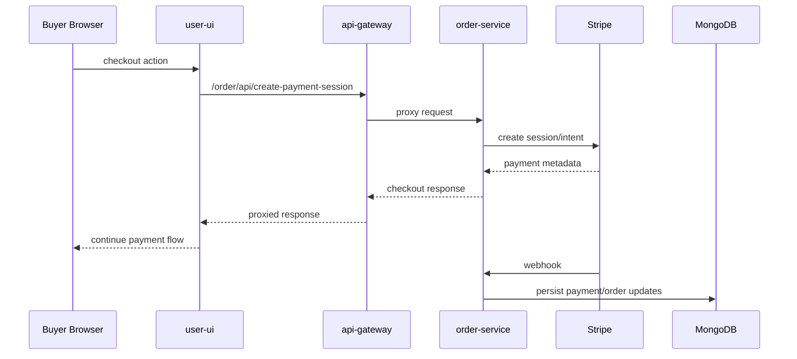

# Request Flows

## Purpose

This document explains the main synchronous request paths through the platform. These flows are important because they show which components participate in a user-visible action and where latency, auth, and failure handling can accumulate.

## Flow 1: Buyer Authentication

### Path

1. Buyer opens `user-ui`
2. `user-ui` submits auth requests to `/auth/api/*`
3. Next.js rewrites or runtime API calls target `NEXT_PUBLIC_SERVER_URI`, which defaults to `api-gateway`
4. `api-gateway` proxies `/auth` traffic to `auth-service`
5. `auth-service` validates credentials, signs JWTs, and sets cookie/token response state
6. shared `isAuthenticated` middleware later hydrates request identity by verifying JWT and loading the user or seller from MongoDB

### Diagram

## Flow 2: Product Discovery And Catalog Browsing

### Path

1. Buyer loads storefront pages or search pages in `user-ui`
2. `user-ui` calls product APIs through the gateway
3. `api-gateway` proxies `/product/*` requests to `product-service`
4. `product-service` handles catalog queries, shop queries, product detail lookup, search routes, and public pricing responses
5. Prisma reads product, shop, event, discount, and pricing-related data from MongoDB

### Notes

- this is a classic request/response flow
- recommendation and analytics enrichment are not required for the base product fetch
- this keeps browse paths simpler than the asynchronous personalization pipeline

## Flow 3: Checkout And Order Creation

### Path

1. Buyer enters checkout in `user-ui`
2. frontend calls order endpoints through `/order/api/*`
3. gateway proxies `/order` traffic to `order-service`
4. `order-service` verifies auth through shared middleware
5. service creates payment session or payment intent via Stripe
6. order verification and payment status endpoints reconcile platform state after Stripe interactions
7. Stripe webhook requests hit `/order/api/webhooks` directly on `order-service`
8. webhook handlers finalize payment-related state transitions in MongoDB

### Diagram

## Flow 4: Seller Product Management

### Path

1. Seller uses `seller-ui`
2. requests hit the gateway using `NEXT_PUBLIC_SERVER_URI`
3. seller auth is enforced through `auth-service` and shared JWT middleware
4. seller product CRUD and seller product summary calls route to `product-service`
5. product-service writes to product, pricing, and shop-related models in MongoDB

### Notes

- seller flows are authenticated
- role checks use shared authorization middleware
- product-service is a large domain owner, not just a simple catalog reader

## Flow 5: AI Vision Request Path

### Path

1. Buyer uses AI Vision screens in `user-ui`
2. frontend calls AI endpoints through gateway-routed `/ai-vision/api/*` paths or the configured public AI Vision base URL
3. gateway proxies to `aivision-service`
4. `aivision-service` applies auth middleware and rate limiting
5. route handlers invoke AI generation, search, concept, collection, gallery, artisan, or comment services
6. the service talks to MongoDB, Gemini, Hugging Face, and ImageKit depending on the feature path

### Notes

- AI Vision is the most integration-heavy synchronous path in the system
- it also has asynchronous supporting jobs through Agenda, but the core user interaction still begins as an HTTP request flow

## Shared Middleware In Request Paths

Across services, a few shared behaviors matter:

- `isAuthenticated` validates JWTs and hydrates `req.user`
- role guards such as `isSeller` and `isAdmin` apply authorization checks
- `errorMiddleware` normalizes application, Prisma, validation, and unexpected errors
- CORS and cookie parsing are configured per service rather than centrally

## Architectural Reading

These request flows show a few design choices clearly:

- the gateway is routing-focused, not business-logic-heavy
- most domain logic sits inside the downstream service
- auth context is rehydrated from the database on protected requests
- AI and payment paths are intentionally isolated because they touch complex external systems

## Related Docs

- [Event Flows](</C:/Users/adity/Desktop/Artistry Cart/artistry-cart/docs/02-architecture/event-flows.md>)
- [Service Topology](</C:/Users/adity/Desktop/Artistry Cart/artistry-cart/docs/02-architecture/service-topology.md>)
