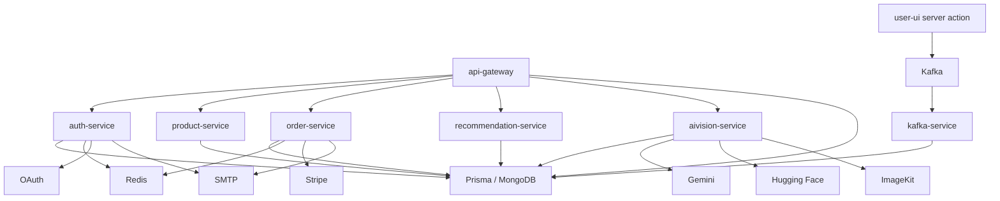

# Service Topology

## Purpose

This document explains how the major runtime components are arranged, what each one depends on, and how traffic and responsibilities are distributed.

## Topology Table

| Component | Type | Default Port | Primary Responsibility | Key Dependencies |
| --- | --- | --- | --- | --- |
| `user-ui` | Next.js app | `3000` | Buyer experience | `api-gateway`, Stripe public key, AI Vision endpoints |
| `seller-ui` | Next.js app | `3001` | Seller operations | `api-gateway`, seller auth flows |
| `api-gateway` | Express service | `8080` | Client-facing backend entry point and proxy routing | downstream services, MongoDB for site config bootstrap |
| `auth-service` | Express service | `6001` | identity, auth, OAuth, onboarding, profile-related endpoints | MongoDB, Redis, Stripe, SMTP, OAuth providers |
| `product-service` | Express service | `6002` | products, shops, search, offers, discounts, events | MongoDB |
| `order-service` | Express service | `6004` | orders, payment intents/sessions, Stripe webhooks, seller payouts | MongoDB, Redis, Stripe, SMTP |
| `recommendation-service` | Express service | `6005` | recommendation API responses | MongoDB, TensorFlow |
| `aivision-service` | Express service | `6006` | AI generation, visual search, concepts, collections, comments, artisans, gallery | MongoDB, Gemini, Hugging Face, ImageKit, Agenda |
| `kafka-service` | background worker | n/a | consume user activity events and materialize analytics | Kafka, MongoDB |
| MongoDB | data store | `27017` | primary persistence | Prisma client in multiple services |
| Redis | cache/auxiliary infra | `6379` | optional fast-path support for selected flows | auth and order codepaths |
| Kafka | event bus | `9092` | analytics event transport | frontend producer and kafka-service consumer |
| Kafka UI | local dev tool | `8089` | inspect Kafka state locally | Kafka |

## Client Entry Paths

### Buyer experience

- browser requests hit `user-ui`
- `user-ui` uses rewrites or runtime API calls against `NEXT_PUBLIC_SERVER_URI`
- default local backend entry point is the gateway on `http://localhost:8080`

### Seller experience

- browser requests hit `seller-ui`
- `seller-ui` uses `NEXT_PUBLIC_SERVER_URI` for backend requests
- in local development, this normally resolves to the gateway

## Gateway Routing

The gateway is a thin routing layer, not an orchestration layer. It currently proxies these paths:

| Prefix | Upstream |
| --- | --- |
| `/auth` | `auth-service` |
| `/product` | `product-service` |
| `/order` | `order-service` |
| `/recommendation` | `recommendation-service` |
| `/ai-vision` | `aivision-service` |

It also initializes site configuration in MongoDB on startup, which means it is not purely stateless.

## Service Dependency Graph

## Shared Code Topology

All services do not reinvent infrastructure independently. They rely on shared packages:

- `packages/libs/prisma` for database access
- `packages/libs/redis` for Redis lifecycle and graceful fallback
- `packages/utils/kafka` for Kafka configuration
- `packages/middleware` for auth and role middleware
- `packages/error-handler` for normalized Express error handling
- `packages/test-utils` for cross-service tests

This creates consistency, but it also creates coupling. Shared packages are a force multiplier as long as they stay small and infrastructure-focused.

## Topology Implications

### Benefits

- teams can reason about the platform by major domain
- deployment units can evolve separately if needed
- AI and analytics workloads are kept off the critical transactional request path
- shared packages reduce setup and code duplication

### Constraints

- shared database ownership makes true service autonomy weaker than the folder structure suggests
- static local proxy assumptions in the gateway limit configuration flexibility
- some cross-domain behavior still depends on code-level conventions rather than hard contracts

## Related Docs

- [System Overview](</C:/Users/adity/Desktop/Artistry Cart/artistry-cart/docs/02-architecture/system-overview.md>)
- [Request Flows](</C:/Users/adity/Desktop/Artistry Cart/artistry-cart/docs/02-architecture/request-flows.md>)
- [Tradeoffs](</C:/Users/adity/Desktop/Artistry Cart/artistry-cart/docs/02-architecture/tradeoffs.md>)
