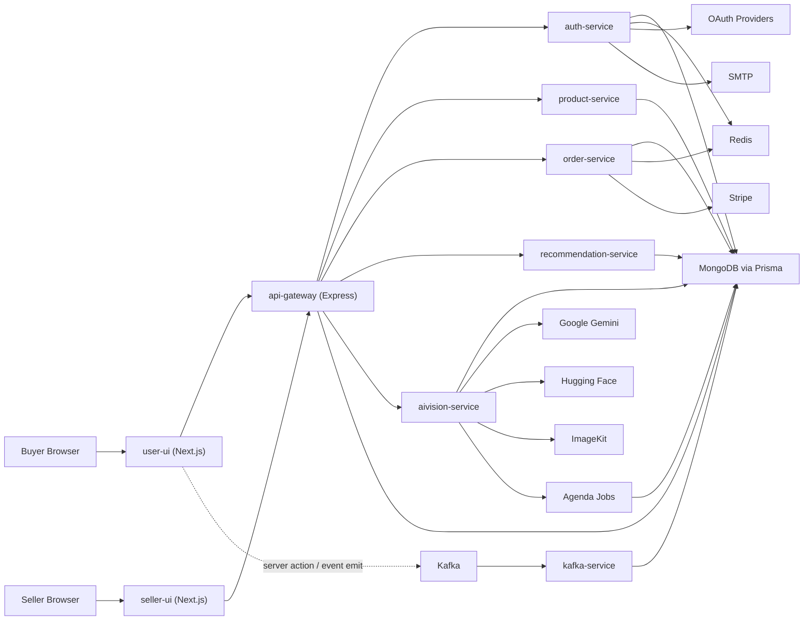

# System Overview

## Summary

Artistry Cart is a service-oriented commerce platform organized as a single Nx monorepo. It combines two Next.js frontends with multiple Express backend services, a shared MongoDB data layer, Redis-backed auxiliary behavior, Kafka-based analytics ingestion, and a dedicated AI Vision service for AI-heavy workflows.

The architecture is modular at the application boundary, but not fully isolated at the infrastructure boundary. Services are split by responsibility, while shared packages and a shared database keep local development and code reuse manageable.

## Runtime Shape

At a high level:

- `user-ui` serves the buyer experience
- `seller-ui` serves seller and shop-management workflows
- `api-gateway` is the main backend entry point for client traffic
- backend services own major domains such as auth, products, orders, recommendations, analytics ingestion, and AI Vision
- Prisma provides shared MongoDB access
- Kafka handles asynchronous user-activity ingestion
- Redis supports optional fast-path runtime behavior in parts of the stack
- Agenda in `aivision-service` runs recurring background jobs against MongoDB

## System Diagram

## Architectural Style

The project uses a hybrid style:

- monorepo for source organization and shared tooling
- service-oriented backend boundaries
- shared database access layer instead of fully separate per-service storage
- asynchronous event processing for analytics and recommendation inputs
- dedicated frontend applications for distinct user personas

This is a practical middle ground between a pure monolith and a fully decoupled distributed system.

## Why The System Is Split This Way

The repository structure suggests a few intentional separations:

- auth is isolated because identity, JWTs, OAuth, cookies, and onboarding flows have their own complexity
- products are isolated because catalog, shops, pricing, events, and discounts form a large business domain
- orders are isolated because payment and webhook flows are operationally sensitive
- recommendations are isolated because recommendation logic has different compute patterns than transactional APIs
- AI Vision is isolated because AI APIs, embeddings, visual search, and background jobs have distinct dependencies and runtime behavior
- Kafka ingestion is isolated because analytics materialization is asynchronous and operationally separate from request handling

## Where The Architecture Is Strong

- clear top-level service boundaries
- buyer and seller experiences are separated cleanly
- shared packages reduce duplication for middleware, Prisma, Redis, Kafka, and tests
- async analytics avoids slowing the transactional request path
- AI-heavy workloads are not jammed into the core product or order services

## Where The Architecture Is Still Transitional

- multiple services share the same MongoDB schema and Prisma client
- gateway proxy targets are hardcoded to local host/port assumptions
- service conventions are similar, but not perfectly standardized
- some operational concerns such as observability and config normalization are only partially encoded

## What To Read Next

- [Service Topology](</C:/Users/adity/Desktop/Artistry Cart/artistry-cart/docs/02-architecture/service-topology.md>)
- [Request Flows](</C:/Users/adity/Desktop/Artistry Cart/artistry-cart/docs/02-architecture/request-flows.md>)
- [Event Flows](</C:/Users/adity/Desktop/Artistry Cart/artistry-cart/docs/02-architecture/event-flows.md>)
- [Data Architecture](</C:/Users/adity/Desktop/Artistry Cart/artistry-cart/docs/02-architecture/data-architecture.md>)
