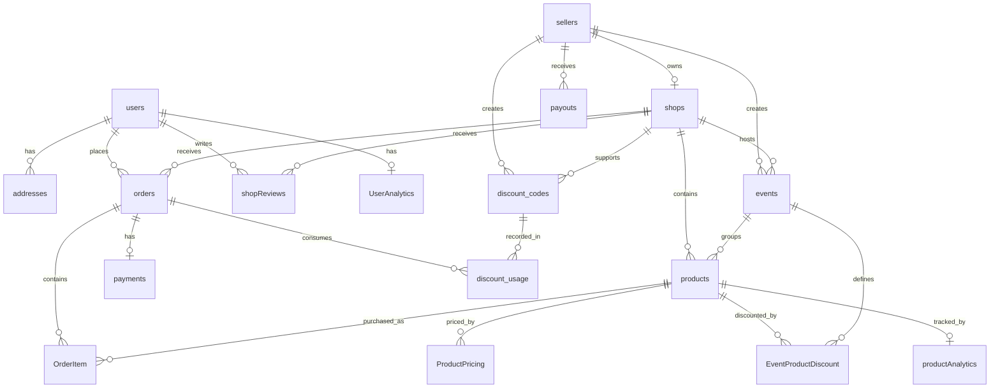
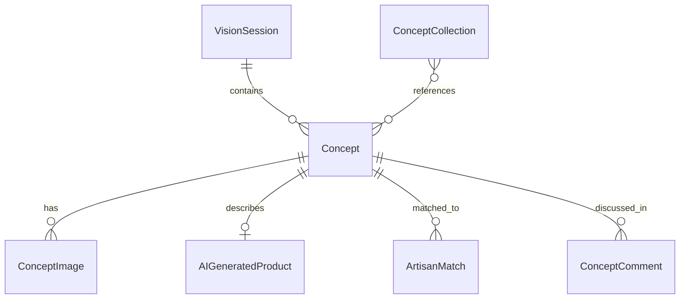

# Entity Relationship Notes

## Purpose

This document explains the most important relationships in the schema in a human-readable way. It is not a complete ERD export. It focuses on the relationships that matter most for reasoning about the platform.

## Core Commerce Graph

## AI Vision Graph

## Relationship Notes

### User vs seller separation

The platform models buyers and sellers separately:

- `users` represent the buyer identity path
- `sellers` represent the supply-side operational path

This is a meaningful business separation rather than a cosmetic one.

### Shop as the supply-side anchor

`shops` connect:

- sellers
- products
- events
- discount codes
- orders
- reviews

This makes shop the main supply-side aggregation node.

### Product as the merchandising anchor

`products` connect:

- shops
- orders via `OrderItem`
- events
- event-product discounts
- pricing history
- product analytics

This makes product the center of the buyer-facing commerce graph.

### Order and payment coupling

Each order:

- belongs to a user
- belongs to a shop
- contains items
- may have one payment
- may be associated with discount usage

This is a standard commerce pattern with explicit payment and refund subgraphs.

### Analytics as read models

`UserAnalytics` and `productAnalytics` are not just raw event logs. They are materialized read-oriented documents derived from behavior processing.

### AI Vision as a separate subgraph

AI Vision has its own coherent data graph, with:

- sessions
- concepts
- images
- generated products
- artisan matches
- collections
- comments

This supports the architectural decision to keep AI workflows in a dedicated service boundary.

## Important Cross-Domain Links

- `products` are referenced by both commerce and AI search/embedding flows
- `sellers` participate in both shop operations and AI artisan-matching flows
- `users` participate in both transactional and recommendation domains

## What This Means Architecturally

The schema is not a collection of isolated tables. It is a connected platform model with:

- a commerce core
- an analytics overlay
- an AI collaboration extension

That is a strong story to tell in design discussions.
