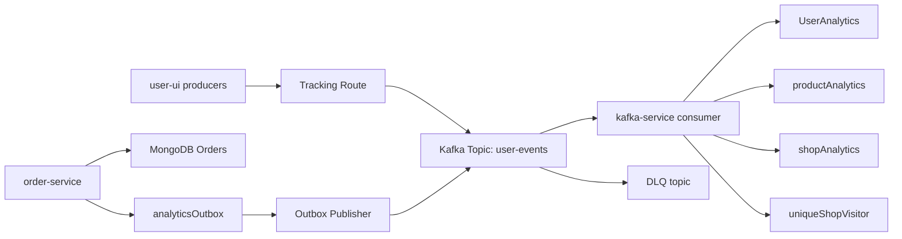
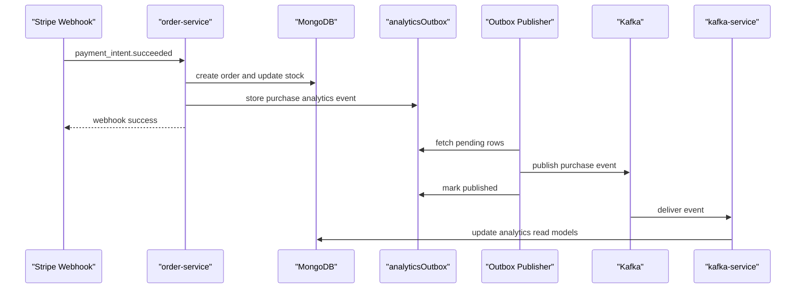
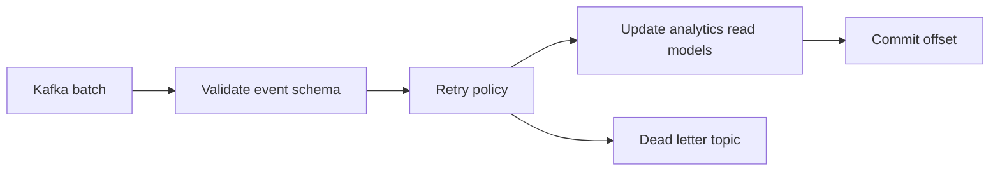

# Artistry Cart Kafka Service System Design

## Executive Summary

Artistry Cart uses Kafka as the asynchronous backbone for user-behavior analytics.

The core idea is:

- frontend interactions and purchase flows produce analytics events
- Kafka decouples event ingestion from downstream processing
- `kafka-service` consumes the events and materializes analytics read models
- `order-service` uses an outbox so purchase writes are not lost if Kafka is temporarily unavailable

This is a strong senior-level project story because it includes:

- real producers and consumers
- shared event contracts
- outbox pattern
- manual offset management
- retries and DLQ
- idempotent consumption
- observability and readiness management

## The Problem Kafka Solves Here

Without Kafka, the platform would have to update analytics synchronously during:

- product page views
- shop visits
- cart changes
- wishlist changes
- checkout completion

That would create several problems:

- buyer-facing latency increases
- order flows become coupled to analytics write health
- analytics failures can spill into core commerce flows
- multiple downstream consumers become harder to support

Kafka solves this by making analytics capture asynchronous and durable.

## Current Architecture

## Producer Flows

### Frontend Analytics

The frontend now publishes through a server-owned tracking boundary.

Important characteristics:

- clients do not directly trust a caller-supplied `userId`
- the tracking route resolves authenticated user context server-side
- all actions share the same contract
- producers include contextual metadata such as `country`, `city`, `device`, and `source`

Representative actions:

- `product_view`
- `shop_visit`
- `add_to_cart`
- `remove_from_cart`
- `add_to_wishlist`
- `remove_from_wishlist`

### Purchase Analytics

Purchase events are different because they are tied to money movement and persistent business state.

That is why `order-service` uses the outbox pattern:

- create order and order-side effects
- persist purchase analytics events into `analyticsOutbox`
- background publisher drains the outbox into Kafka

This protects the system from the classic failure:

- database write succeeds
- Kafka publish fails
- event is silently lost

## Purchase Outbox Flow

## Event Contract

The shared contract is one of the most important design improvements.

Key fields:

- `eventId`
- `schemaVersion`
- `userId`
- `action`
- `productId`
- `shopId`
- `quantity`
- `timestamp`
- `source`
- optional user context such as `country`, `city`, and `device`

Why this matters:

- producers and consumers validate against the same vocabulary
- replay and debugging become easier
- observability improves because `source` and `eventId` travel end to end

## Why Key By `userId`

The producer keys analytics messages by `userId`.

Reason:

- user actions such as view, cart change, wishlist change, and purchase often make the most sense when kept in per-user order

Tradeoff:

- if one user becomes extremely hot, that key can cause skew
- for this analytics use case, the tradeoff is acceptable because normal traffic is high-cardinality

Strong interview sentence:

> We chose `userId` as the partition key because the dominant ordering domain was user activity, and preserving per-user event order mattered more than perfect load uniformity.

## Kafka Consumer Design

The `kafka-service` consumer is intentionally production-oriented.

Important choices:

- manual offset commits
- batch processing
- retry with exponential backoff
- optional DLQ publishing
- readiness-aware shutdown
- schema validation before persistence
- idempotent document updates using processed-event keys

## Consumer Flow

## Data Model Strategy

The Kafka consumer materializes read-side analytics into MongoDB collections:

- `UserAnalytics`
- `productAnalytics`
- `shopAnalytics`
- `uniqueShopVisitor`

This is a classic read-model materialization approach.

Benefits:

- query patterns stay simple for downstream features
- recommendation and analytics surfaces can read optimized state
- Kafka replay can rebuild state if the consumer logic changes

Tradeoff:

- consumer logic must stay idempotent
- read models may be eventually consistent rather than instantly current

## Reliability Model

### Delivery Semantics

The practical model here is:

- producer sends durable events
- consumer operates with at-least-once assumptions
- sink updates are idempotent

This is not global exactly-once.

It is:

- durable
- replay-friendly
- operationally realistic

### Idempotency

The consumer stores processed-event keys on analytics documents.

Why:

- if Kafka redelivers after a crash or retry, repeated writes should not double-count analytics

### DLQ

Invalid or exhausted events can go to a dead-letter topic.

Why:

- production traffic should not stop because of poison messages
- operators need somewhere to inspect failures

## Operational Considerations

### What To Monitor

- consumer lag
- retry count
- DLQ publish count
- failed commit count
- outbox backlog size
- outbox publish failures
- Kafka producer send failures
- readiness state
- end-to-end time from event creation to analytics materialization

### What Can Fail

1. frontend tracking route cannot publish
2. outbox publisher falls behind
3. Kafka broker becomes slow or unavailable
4. consumer sink writes become slow
5. poison events fail schema validation
6. partition skew creates uneven lag

### Senior Incident Language

Good interview wording:

> I separate ingestion reliability from processing reliability. The outbox protects the order-writing boundary, Kafka protects durable transport, and the consumer uses idempotent processing plus delayed commits so failures do not silently lose business events.

## Why This Design Is Good For Senior Interviews

This project gives you real talking points across multiple levels.

### Architecture Level

- async decoupling
- event-driven read-model materialization
- producer-consumer contract design

### Consistency Level

- outbox pattern
- idempotent consumer updates
- at-least-once semantics

### Operations Level

- retries
- DLQ
- readiness
- lag monitoring

### Tradeoff Level

- per-user ordering versus partition balance
- eventual consistency versus synchronous accuracy
- simplicity versus schema-governance rigor

## What I Would Say In A Senior Interview

### Two-Minute Version

> We use Kafka to capture user-behavior and purchase analytics without coupling those writes to buyer-facing latency. The frontend and order flows publish standardized analytics events to Kafka. For purchase events, the order service uses an outbox so we do not lose events when the order database write succeeds but Kafka is unavailable. A dedicated Kafka consumer validates events, retries transient failures, dead-letters invalid ones, commits offsets only after persistence, and materializes MongoDB read models for user, product, and shop analytics. The design is intentionally at-least-once with idempotent consumers rather than pretending to do global exactly-once.

### Five-Minute Version

Cover these sections:

1. business reason for async analytics
2. shared contract and producer strategy
3. outbox for purchases
4. consumer safety model
5. observability and tradeoffs

### Ten-Minute Deep-Dive Version

Add:

- partition key choice
- offset-commit reasoning
- DLQ strategy
- replay and schema evolution story
- future scale improvements

## Likely Interviewer Follow-Up Questions

### Why Not Publish Directly From `order-service` Without An Outbox?

Answer:

Because the order database write and Kafka publish are separate systems. If the order persists and Kafka publish fails, purchase analytics are silently lost. The outbox closes that gap by making the event durable in the same persistence boundary as the order workflow.

### Why Not Commit Offsets First And Then Process?

Answer:

That risks data loss. If the consumer commits before the sink write succeeds and then crashes, Kafka assumes the message is done even though the side effect never happened.

### Why Not Use Exactly-Once Everywhere?

Answer:

Because global exactly-once across Kafka plus arbitrary databases is expensive and often misleading. In this case, at-least-once with idempotent consumer logic is simpler, more transparent, and operationally sufficient.

### How Would You Scale This?

Answer:

I would first watch partition distribution and consumer lag, then scale consumers up to partition count, batch writes more efficiently, and validate that MongoDB remains the real bottleneck. If throughput outgrows the topic design, I would revisit partition count and key distribution.

### What Would You Improve Next?

Answer:

- schema registry or stronger contract governance
- lag-aware autoscaling
- richer outbox metrics and dashboards
- replay tooling
- stronger partition-skew analysis

## Honest Limitations To Mention

Senior candidates sound stronger when they mention limits openly.

Good examples:

- ordering is only per partition, not global
- eventual consistency is acceptable here but not for every domain
- processed-event-key arrays need lifecycle consideration at scale
- schema registry is still a future hardening step
- analytics workloads and transactional workloads have different durability priorities

## Final Message

If you can explain this system clearly, you are not just describing Kafka.

You are demonstrating:

- distributed-systems thinking
- reliability design
- data-consistency awareness
- production operations maturity
- ownership of tradeoffs
