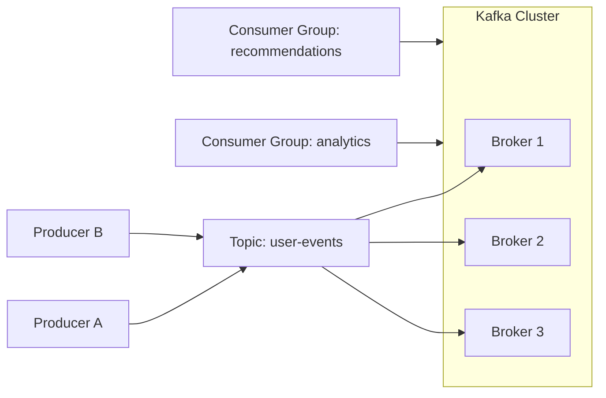
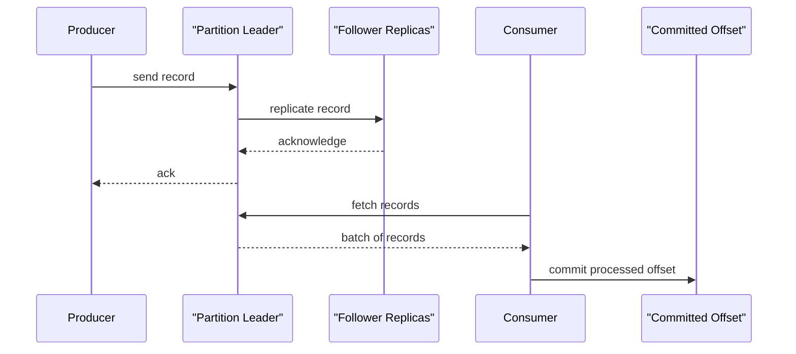
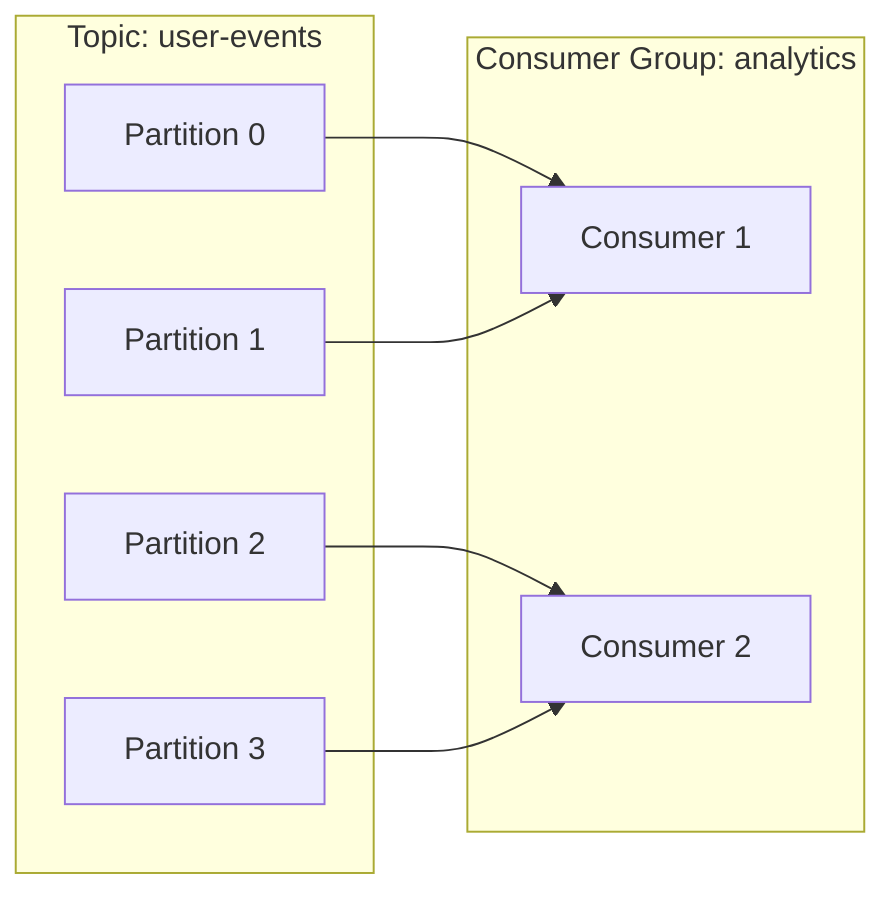
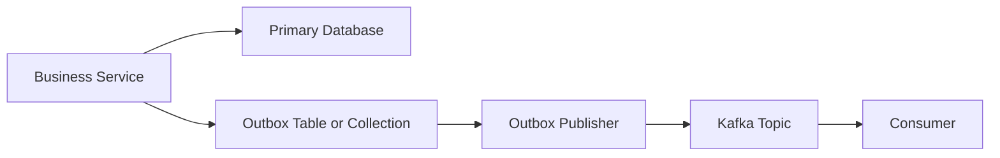

# Kafka Fundamentals To Advanced

## What Kafka Is

Kafka is a distributed event streaming platform used to publish, store, and consume ordered logs of events at high throughput.

At interview level, the clean definition is:

> Kafka is a durable, partitioned, replicated commit log that lets producers write events and consumers read them independently at their own pace.

## Why Teams Use Kafka

Kafka is usually chosen when a system needs one or more of these:

- asynchronous decoupling between services
- durable event history
- high write throughput
- multiple independent consumers of the same stream
- replay of events
- streaming analytics or read-model materialization
- backpressure isolation between producers and downstream consumers

## Core Building Blocks

### Broker

A broker is a Kafka server that stores partitions and serves reads and writes.

### Topic

A topic is a named stream of records.

Examples:

- `user-events`
- `orders`
- `payments`

### Partition

A partition is an ordered append-only log within a topic.

Important:

- ordering is guaranteed only within a partition
- partitions are the unit of parallelism
- partition count is one of the most important design choices in Kafka

### Offset

An offset is the position of a record inside a partition.

Offsets are:

- partition-local
- monotonically increasing
- used by consumers to resume reading

### Producer

A producer publishes records to a topic.

### Consumer

A consumer reads records from one or more partitions.

### Consumer Group

A consumer group is a set of consumers that share work.

Within one consumer group:

- each partition is assigned to only one consumer at a time
- consumers scale parallelism by partition count

### Replication

Partitions are replicated across brokers for durability and availability.

### Leader And Followers

Each partition has:

- one leader replica, which handles reads and writes
- follower replicas, which replicate from the leader

## High-Level Architecture

Key point:

- one producer can feed many consumer groups
- each consumer group has its own offsets and pace

## How A Record Moves Through Kafka

This is where many interview questions come from:

- when is a write considered durable
- when should a consumer commit
- what happens if the consumer crashes after processing but before commit

## Topics, Partitions, And Ordering

The most common interview trap is saying Kafka preserves global topic order.

That is incorrect.

Correct answer:

- Kafka preserves order only within a partition
- if order matters for a key, all related events must land in the same partition

Examples:

- key by `userId` to preserve per-user action order
- key by `orderId` to preserve per-order state transitions

Tradeoff:

- stronger ordering by key reduces distribution flexibility
- poor key choice can create hot partitions

## Replication, ISR, And Durability

Kafka partitions are replicated.

Important terms:

- replication factor: total number of replicas for a partition
- ISR: in-sync replicas, the replicas caught up enough to be eligible for durability guarantees
- leader election: choosing a new leader when the current one fails

Example:

- replication factor = 3
- one leader
- two followers

If `acks=all`, the producer waits until the leader and required replicas acknowledge the write.

Senior talking point:

- higher durability usually costs latency
- durability is not free
- the right setting depends on the business consequence of message loss

## Producer Internals

### Partitioning

The producer decides the destination partition by:

- explicit partition
- hash of the message key
- round-robin or sticky partitioning when there is no key

### Batching

Producers batch records for throughput.

This improves:

- network efficiency
- broker throughput

But it can slightly increase latency.

### Compression

Common codecs:

- `snappy`
- `lz4`
- `zstd`
- `gzip`

Good interview answer:

- compression reduces network and storage cost
- `zstd` is often a strong choice when supported and CPU budget is acceptable

### Acknowledgment Modes

Common `acks` settings:

- `acks=0`: fire and forget, lowest durability
- `acks=1`: leader ack only
- `acks=all`: wait for full durability policy

### Idempotent Producer

Idempotent producer prevents duplicate writes caused by retrying the same send to Kafka.

Important nuance:

- idempotent producer helps with duplicate production into Kafka
- it does not solve duplicate side effects in downstream consumers

### Transactions

Kafka transactions let a producer atomically write to multiple partitions and optionally commit offsets with produced output.

This is useful in some stream-processing or consume-transform-produce workflows.

Senior nuance:

- transactions are useful but not universally required
- they add complexity and cost
- many systems still rely on at-least-once plus idempotent consumers

## Consumer Internals

### Pull Model

Consumers pull records from brokers.

Advantages:

- consumers control pace
- batching is easier
- backpressure is more manageable

### Consumer Group Mechanics

Important rules:

- one partition goes to one consumer within a group
- more consumers than partitions means some consumers sit idle
- more partitions than consumers means some consumers own multiple partitions

### Offset Commit Strategies

Offsets can be committed:

- automatically
- manually

For serious production consumers, manual commit is usually easier to reason about.

Best-practice mental model:

- process record
- persist side effect safely
- commit offset after success

If you commit too early, you can lose work.

If you commit too late, you may reprocess after failure.

### Rebalances

A rebalance happens when partition assignments change.

Common triggers:

- a consumer joins
- a consumer leaves
- topic partitions change

Problems rebalances can cause:

- processing pauses
- duplicate work if offsets are not handled carefully
- cache warmup issues

Senior point:

- rebalances are an operational concern, not just a library detail

## Delivery Semantics

### At-Most-Once

- message may be lost
- no redelivery after failure

### At-Least-Once

- message may be delivered more than once
- consumers must be idempotent

### Exactly-Once

Exactly-once is often misunderstood.

A strong senior answer is:

> Kafka can provide exactly-once guarantees in a narrow sense when producer idempotence and transactions are used correctly, but end-to-end exactly-once across arbitrary external systems is still difficult. In most business systems, I assume at-least-once delivery and design idempotent consumers.

## Retention And Log Compaction

Kafka stores records based on policies.

### Time-Based Or Size-Based Retention

Examples:

- keep 7 days
- keep up to 500 GB

Used when full event history matters for a limited period.

### Log Compaction

Kafka keeps the latest record per key.

Best for:

- changelog topics
- materialized current state
- config topics

Tradeoff:

- compaction is not a queue cleanup trick
- it is for key-based latest-state semantics

## When To Use Kafka Versus A Queue

Kafka is stronger when you need:

- durable replay
- many independent consumers
- high throughput
- ordering by key
- stream history

A traditional queue can be simpler when you only need:

- one consumer path
- task distribution
- short-lived async jobs

## Common Design Patterns

### Event Notification

A service emits an event after a state change.

### Event-Carried State Transfer

The event contains enough data for downstream services to act without calling back immediately.

### Outbox Pattern

This is one of the most interview-relevant patterns.

Why it matters:

- avoids losing events when DB write succeeds but Kafka publish fails
- creates a reliable bridge between local transactions and async messaging

### Read Model Materialization

Consumers update optimized read-side models for analytics, search, or recommendations.

### DLQ Pattern

Poison or permanently invalid messages go to a dead-letter topic for inspection.

Senior nuance:

- DLQ is not a substitute for fixing bad producers
- it is an operational containment tool

## Partition Key Strategy

This is one of the best senior differentiators in interviews.

You should always discuss:

- ordering requirements
- expected cardinality
- hot-key risk
- reprocessing impact

Bad keys:

- low-cardinality fields like `country`
- fields with heavy skew like `tenantId` when one tenant dominates traffic

Good keys:

- `userId`, `orderId`, `shopId`, depending on the required ordering domain

## Performance Tuning Knobs

### Producer Side

- `linger.ms`
- batch size
- compression type
- `acks`
- retries
- max in-flight requests
- idempotence

### Consumer Side

- fetch sizes
- max poll interval
- commit strategy
- concurrency per partition set
- batch-processing size

### Broker And Topic Side

- partition count
- replication factor
- retention policy
- compaction policy

## Scaling Kafka Systems

To scale responsibly, think in layers:

### Scale Producers

- batch writes
- compress messages
- avoid tiny-message overhead when possible

### Scale Topics

- increase partition count with care
- understand that repartitioning can change parallelism and key distribution

### Scale Consumers

- add more consumers up to partition count
- keep processing idempotent
- watch rebalance behavior

### Scale Downstream Systems

Kafka can absorb bursts, but downstream databases often become the bottleneck.

Senior answer pattern:

- Kafka is not the whole system
- you must scale the sink too

## Observability And Operations

Monitor these first:

- consumer lag
- rebalance frequency
- producer send failures
- broker disk usage
- under-replicated partitions
- ISR shrink events
- DLQ volume
- end-to-end processing latency
- offset commit failures

In interviews, good candidates also mention:

- dashboards
- alerts
- runbooks
- replay procedure

## Common Failure Scenarios

### Broker Failure

Expected behavior:

- followers elect a new leader
- clients retry
- temporary latency increase may occur

### Consumer Crash After Side Effect But Before Commit

Expected result:

- same record is read again
- consumer must be idempotent

### Producer Retry Causing Duplicate Intent

Mitigation:

- idempotent producer
- business-level dedupe keys

### Poison Message

Mitigation:

- bounded retries
- DLQ
- schema validation

### Hot Partition

Symptoms:

- skewed lag
- one consumer overloaded
- uneven throughput

Fix:

- redesign key strategy
- sometimes split key space or change topic model

## Senior Tradeoff Language

These are the kinds of statements interviewers want to hear:

- "I optimize for at-least-once plus idempotent consumers unless the workflow truly justifies transaction cost."
- "Ordering requirements drive partition-key choice, so I always identify the ordering domain first."
- "Kafka can absorb spikes, but I still design around sink pressure and retry storms."
- "I separate transient failures from permanent failures and only send exhausted or invalid events to DLQ."
- "Schema changes are contract changes, so I treat them as rollout events, not casual refactors."

## Fast Revision Sheet

### If Asked "What Is A Partition?"

Say:

> A partition is Kafka's unit of storage, ordering, and parallelism inside a topic.

### If Asked "What Is Consumer Lag?"

Say:

> Consumer lag is the distance between the latest produced offset and the consumer's committed or processed offset.

### If Asked "How Do You Avoid Duplicates?"

Say:

> I rely on idempotent production where needed, manual offset control, and idempotent consumers using business keys or processed-event tracking.

### If Asked "How Do You Preserve Order?"

Say:

> I preserve order by selecting a partition key that keeps related events in the same partition, because Kafka only guarantees order within a partition.

### If Asked "When Would You Use DLQ?"

Say:

> I use DLQ for invalid or exhausted messages after bounded retries, so operators can inspect poison events without stalling healthy traffic.

## Final Interview Advice

For senior Kafka interviews, do not stop at definitions.

Always connect each concept to:

- production behavior
- a failure mode
- the tradeoff
- how you would implement or operate it in a real system
