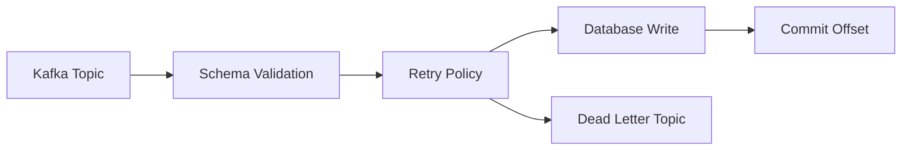
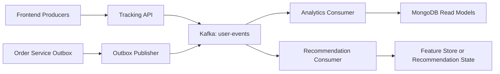

# Kafka Round By Round Practice

## Purpose

This guide helps you practice Kafka the way real interview loops usually happen.

For a senior role, Kafka questions are rarely just:

- "What is Kafka?"

They are more often:

- "Design a reliable event pipeline."
- "How would you handle duplicates?"
- "Why Kafka and not RabbitMQ?"
- "How would you scale this consumer fleet?"
- "What happened in a real incident and how did you handle it?"

## Round 1: Recruiter Or Hiring Manager

### What They Are Testing

- can you explain your work clearly
- do you sound like you actually owned distributed-system decisions
- can you tie Kafka to business outcomes

### Practice Prompt

Explain your Kafka experience in 2 minutes.

### Strong Answer Structure

1. what problem the system solved
2. what your role was
3. how Kafka fit into the architecture
4. what production concerns you handled
5. what outcome improved

### Example Answer

> I used Kafka to decouple user-facing workflows from downstream analytics and recommendation processing. In Artistry Cart, the frontend and order flows produce user-behavior events, and a dedicated Kafka consumer materializes analytics read models in MongoDB. My work included defining the shared event contract, building safe producers, using an outbox for purchase events, implementing manual offset commits, retries, DLQ handling, and idempotent consumer logic. The main outcome was a more reliable analytics pipeline that did not block checkout or product interactions on downstream processing.

### Common Mistakes

- speaking only about theory
- not naming tradeoffs
- not saying what you personally changed

## Round 2: Fundamentals And Deep Dive

### What They Are Testing

- correctness of core Kafka concepts
- whether you understand semantics, not just APIs

### Practice Questions

1. What is a partition?
2. How does Kafka preserve ordering?
3. What is consumer lag?
4. What happens during a rebalance?
5. What is the difference between `acks=1` and `acks=all`?
6. Why is at-least-once common in Kafka systems?
7. What problem does an idempotent consumer solve?

### Strong Answer Pattern

For each question:

1. define it precisely
2. explain the consequence in production
3. mention one tradeoff or failure mode

### Example

Prompt:

> How does Kafka preserve ordering?

Strong answer:

> Kafka preserves ordering only within a partition. That means key choice is critical. If I need per-user ordering, I key by `userId` so all related events land in the same partition. The tradeoff is that a poor key can create a hot partition and reduce scaling efficiency.

## Round 3: Low-Level Design Or Implementation

### What They Are Testing

- whether you can design a correct producer or consumer
- how you handle retries, commits, validation, and side effects

### Practice Prompt

Design a Kafka consumer that updates analytics in a database.

### What A Senior Answer Should Cover

- schema validation before side effects
- manual offset control
- bounded retries
- DLQ for poison or exhausted messages
- idempotent sink updates
- graceful shutdown
- health and metrics

### Good Whiteboard Shape

### Strong Verbal Walkthrough

> I would not auto-commit offsets. I would validate the event, process it, persist the result, and commit only after the write succeeds. For transient failures I would retry with backoff. For invalid messages or exhausted retries I would publish to a DLQ. Because Kafka is at-least-once, I would make the database write idempotent using a processed-event key or business dedupe key.

## Round 4: System Design

### What They Are Testing

- can you use Kafka as part of a larger system
- can you reason about scale, correctness, and operations

### Practice Prompt

Design an event-driven analytics platform for an ecommerce product.

### Expected Structure

1. define requirements
2. split producers, transport, consumers, and sinks
3. discuss ordering and partition keys
4. discuss durability and failure handling
5. discuss observability and replay
6. discuss evolution and schema governance

### Strong Requirements Breakdown

Functional:

- ingest user actions
- support multiple downstream consumers
- materialize analytics
- replay for bug fixes or backfills

Non-functional:

- high throughput
- low producer latency
- durability
- resilience to consumer failures
- traceability and observability

### Good System Design Diagram

### Follow-Up Questions You Should Expect

- Why not write analytics directly from the frontend service?
- How do you avoid duplicate purchases?
- What if one consumer is slow?
- How do you version event schemas?
- How do you replay historical data safely?

## Round 5: Incident And Troubleshooting

### What They Are Testing

- whether you can operate Kafka in production
- whether you stay calm and systematic during failures

### Practice Prompt

Your analytics consumer lag suddenly spikes. What do you do?

### Strong Response Structure

1. verify blast radius
2. check broker health and consumer health
3. compare ingress rate versus processing rate
4. identify skew, rebalance, or sink bottleneck
5. mitigate
6. define postmortem actions

### Strong Answer

> I would first confirm whether the lag is across all partitions or only a subset. If it is skewed, I would suspect a hot partition or a stuck consumer. I would check rebalance frequency, commit errors, downstream DB latency, retry volume, and DLQ growth. If the sink is the bottleneck, scaling consumers alone may not help, so I would reduce pressure with batch tuning or temporary throttling while protecting data correctness. Then I would define a permanent fix, such as changing the partition key, increasing sink capacity, or optimizing the consumer path.

### Other Practice Incidents

- broker failure during peak traffic
- repeated duplicate downstream writes
- poison messages causing retry storms
- out-of-order business events
- outbox backlog growing faster than it drains

## Round 6: Senior Leadership And Tradeoffs

### What They Are Testing

- whether you can choose among imperfect options
- whether you understand cost, complexity, and long-term maintenance

### Practice Prompt

When would you not choose Kafka?

### Strong Answer

> I would not choose Kafka if the use case is just simple background job dispatch with one consumer path and no replay or multi-subscriber need. Kafka adds operational overhead, schema-governance responsibility, and more complex failure modes. If I do not need durable stream history, independent consumer groups, or high-throughput event pipelines, a simpler queue or even synchronous handling may be the better engineering choice.

### Practice Tradeoff Questions

- When do you choose compaction over retention-only topics?
- When do you use transactions versus idempotent consumers?
- When do you split topics versus adding consumers?
- When does an outbox become necessary?
- How do you balance latency against durability?

## Self-Evaluation Rubric

Score yourself from 1 to 5 on each:

- correctness
- clarity
- tradeoff depth
- production realism
- use of examples
- ownership language

If an answer is technically correct but has no production tradeoff, it is usually not senior enough.

## Practice Script For A Senior Loop

### Two-Minute Kafka Intro

Explain:

- what Kafka is
- why it exists in modern systems
- what production challenges it introduces

### Five-Minute Design Walkthrough

Explain:

- producers
- topic design
- consumer strategy
- retry and DLQ
- observability

### Ten-Minute Project Story

Explain:

- business problem
- architecture
- hardest engineering decisions
- incident risks
- future improvements

## Final Advice

For a senior interview:

- do not memorize definitions only
- do not oversell exactly-once
- do not ignore operations
- do not say "Kafka is faster" without saying faster than what and why
- always anchor your answer in throughput, durability, ordering, replay, and ownership
