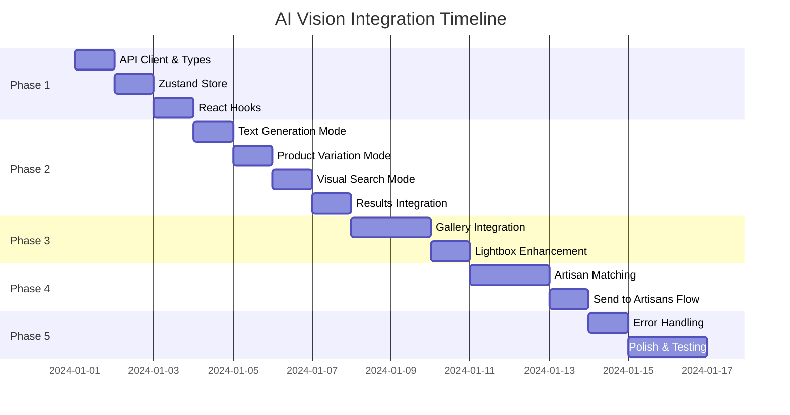

# AI Vision API Integration Plan

> **Document Created:** 2025-12-29  
> **Status:** ✅ ALL PHASES COMPLETE  
> **Last Updated:** 2025-12-30  
> **Integration Ready for Testing**

---

## 📋 Executive Summary

This document outlines the comprehensive plan to integrate the **AI Vision Service** backend APIs into the **User UI** frontend. Currently, the frontend uses static/mock data for demonstration purposes. This integration will connect all AI-powered features (generation, search, gallery, artisan matching) to the live backend service.

---

## 🏗️ Architecture Overview

### Backend Service: `apps/aivision-service`
- **Base URL:** `/api/v1/ai`
- **Port:** 6006
- **Auth:** Session-token based with optional JWT authentication
- **Rate Limiting:** Applied globally

### Frontend Application: `apps/user-ui`  
- **Framework:** Next.js (App Router)
- **State Management:** Zustand + React Context
- **HTTP Client:** Axios (existing `axiosInstance`)
- **Styling:** CSS Variables + Tailwind

---

## 📡 API Endpoint Inventory

### Generation APIs (`/api/v1/ai/generate`)
| Endpoint | Method | Description | Auth Required |
|----------|--------|-------------|---------------|
| `/text-to-image` | POST | Generate images from text prompt | Optional |
| `/product-variation` | POST | Create variations of existing products | Optional |
| `/from-image` | POST | Generate from uploaded image (Phase 3) | Optional |
| `/refine` | POST | Refine an existing concept | Optional |

### Concept Management APIs (`/api/v1/ai/concepts`)
| Endpoint | Method | Description | Auth Required |
|----------|--------|-------------|---------------|
| `/` | GET | List user's concepts | Optional |
| `/:id` | GET | Get single concept details | No |
| `/:id/save` | POST | Save concept to user account | **Yes** |
| `/:id` | DELETE | Delete a concept | **Yes** |
| `/:id/send-to-artisans` | POST | Send concept to selected artisans | **Yes** |

### Search APIs (`/api/v1/ai/search`)
| Endpoint | Method | Description | Auth Required |
|----------|--------|-------------|---------------|
| `/visual` | POST | Visual similarity search | Optional |
| `/hybrid` | POST | Combined text + visual search | Optional |
| `/similar-concepts` | POST | Find similar AI concepts | No |
| `/quick?q=` | GET | Quick text search for products | No |

### Artisan APIs (`/api/v1/ai/artisans`)
| Endpoint | Method | Description | Auth Required |
|----------|--------|-------------|---------------|
| `/match?conceptId=` | GET | Get artisan matches for a concept | No |
| `/respond` | POST | Artisan responds to a match request | **Seller Only** |
| `/my-matches` | GET | Get seller's pending matches | **Seller Only** |

### Gallery APIs (`/api/v1/ai/gallery`)
| Endpoint | Method | Description | Auth Required |
|----------|--------|-------------|---------------|
| `/` | GET | Browse public concept gallery | No |
| `/:id` | GET | Get gallery item details | No |
| `/:id/favorite` | POST | Toggle favorite status | Optional |
| `/:id/related` | GET | Get related gallery items | No |

### Schema/Metadata APIs (`/api/v1/ai/schema`)
| Endpoint | Method | Description | Auth Required |
|----------|--------|-------------|---------------|
| `/categories` | GET | Get available categories | No |
| `/materials` | GET | Get material options | No |
| `/styles` | GET | Get style keywords | No |

---

## 🎯 Frontend Components to Integrate

### Phase 1: Foundation Layer
| Component Path | Current State | Integration Needed |
|----------------|---------------|-------------------|
| `src/lib/api/aivision.ts` | **Does Not Exist** | Create new API client |
| `src/types/aivision.ts` | **Does Not Exist** | Create TypeScript types |
| `src/store/aivisionStore.ts` | **Does Not Exist** | Create Zustand store |
| `src/hooks/useAIVision.ts` | **Does Not Exist** | Create React hooks |

### Phase 2: Generator Integration
| Component | Current State | Integration Needed |
|-----------|---------------|-------------------|
| `AIGenerator.tsx` | Mock `setTimeout` + static data | Real API calls |
| `Mode1_TextGeneration/index.tsx` | Static form | Call `/generate/text-to-image` |
| `Mode2_ProductVariation/index.tsx` | Static form + mock products | Call `/search/quick` + `/generate/product-variation` |
| `Mode3_VisualSearch/index.tsx` | Static upload | Call `/search/visual` or `/search/hybrid` |
| `Results/ConceptCard.tsx` | Static interface | Adapt to API response schema |
| `Results/index.tsx` | Static buttons | Wire save, refine, send actions |
| `LoadingState.tsx` | Pure UI | No changes needed |

### Phase 3: Gallery Integration
| Component | Current State | Integration Needed |
|-----------|---------------|-------------------|
| `ConceptGallery.tsx` | `generateMockConcepts()` | Call `/gallery` with pagination |
| `GalleryFilters.tsx` | Local state | Sync with `/schema/categories` |
| `GalleryItem.tsx` | Static display | Adapt to gallery item schema |
| `ConceptLightbox.tsx` | Static modal | Fetch full details via `/gallery/:id` |

### Phase 4: Artisan Collaboration Integration
| Component | Current State | Integration Needed |
|-----------|---------------|-------------------|
| `ArtisanCollaboration.tsx` | Static layout | Display matched artisans |
| `ArtisanProfileCard.tsx` | Static mock data | Fetch from `/artisans/match` |
| `SendToArtisansModal.tsx` | Simulated success | Call `/concepts/:id/send-to-artisans` |
| `ArtisanMatchingFlow.tsx` | Animation only | Real matching flow integration |

---

## 📦 Detailed Phase Breakdown

---

## Phase 1: Foundation Layer (API Client & Types)

### 1.1 Create AI Vision API Client
**File:** `src/lib/api/aivision.ts`

```typescript
// Key exports to implement:
export const aiVisionApi = {
  // Generation
  textToImage: (params: TextToImageParams) => Promise<GenerationResponse>,
  productVariation: (params: ProductVariationParams) => Promise<GenerationResponse>,
  refineConcept: (params: RefinementParams) => Promise<GenerationResponse>,
  
  // Search
  visualSearch: (params: VisualSearchParams) => Promise<SearchResponse>,
  hybridSearch: (params: HybridSearchParams) => Promise<SearchResponse>,
  quickSearch: (query: string, limit?: number) => Promise<QuickSearchResponse>,
  
  // Concepts
  listConcepts: (params?: ListConceptParams) => Promise<ConceptListResponse>,
  getConcept: (id: string) => Promise<ConceptDetailResponse>,
  saveConcept: (id: string, title?: string) => Promise<SaveResponse>,
  deleteConcept: (id: string) => Promise<DeleteResponse>,
  sendToArtisans: (id: string, params: SendToArtisansParams) => Promise<SendResponse>,
  
  // Gallery
  getGallery: (params?: GalleryParams) => Promise<GalleryResponse>,
  getGalleryItem: (id: string) => Promise<GalleryItemResponse>,
  toggleFavorite: (id: string) => Promise<FavoriteResponse>,
  getRelatedItems: (id: string, limit?: number) => Promise<RelatedItemsResponse>,
  
  // Artisans
  getArtisanMatches: (conceptId: string) => Promise<ArtisanMatchesResponse>,
  
  // Schema
  getCategories: () => Promise<CategoriesResponse>,
  getMaterials: () => Promise<MaterialsResponse>,
  getStyles: () => Promise<StylesResponse>,
};
```

### 1.2 Create TypeScript Types
**File:** `src/types/aivision.ts`

```typescript
// Derive from backend validator schemas:
// - TextToImageSchema
// - ProductVariationSchema
// - RefineConceptSchema
// - VisualSearchSchema
// - SendToArtisansSchema
// - GeneratedProductSchema

// Key types to define:
export interface AIVisionConcept { ... }
export interface GeneratedImage { ... }
export interface GeneratedProduct { ... }
export interface ArtisanMatch { ... }
export interface GalleryItem { ... }
export interface TextToImageParams { ... }
export interface GenerationResponse { ... }
// ... etc
```

### 1.3 Create Zustand Store
**File:** `src/store/aivisionStore.ts`

```typescript
interface AIVisionState {
  // Session
  sessionId: string | null;
  sessionToken: string | null;
  
  // Generation
  isGenerating: boolean;
  currentConcepts: Concept[];
  generationError: string | null;
  
  // Gallery
  galleryItems: GalleryItem[];
  galleryPagination: Pagination;
  selectedFilters: Filters;
  
  // Artisans
  matchedArtisans: ArtisanMatch[];
  selectedArtisanIds: string[];
  
  // User Concepts
  savedConcepts: Concept[];
  
  // Actions
  generate: (mode: GenerationMode, params: any) => Promise<void>;
  saveConcept: (id: string) => Promise<void>;
  loadGallery: (params: GalleryParams) => Promise<void>;
  // ... etc
}
```

### 1.4 Create React Hooks
**File:** `src/hooks/useAIVision.ts`

```typescript
// Custom hooks for common patterns:
export function useAIGeneration() { ... }
export function useConceptGallery() { ... }
export function useArtisanMatching(conceptId: string) { ... }
export function useSchemaData() { ... }
export function useSavedConcepts() { ... }
```

### 1.5 Deliverables Checklist
- [x] `src/lib/api/aivision.ts` - Full API client implementation ✅
- [x] `src/types/aivision.ts` - Complete type definitions ✅
- [x] `src/store/aivisionStore.ts` - Zustand store with persistence ✅
- [x] `src/hooks/useAIVision.ts` - React hooks collection ✅
- [x] `next.config.js` - API proxy rewrite for `/ai-vision` ✅
- [ ] Unit tests for API client (optional but recommended)

---

## Phase 2: Generator Integration

### 2.1 Update `AIGenerator.tsx`
**Current:** Uses `setTimeout` to simulate 2.5s generation with mock results  
**Target:** Call actual generation API, handle loading/error states, persist session

**Changes Required:**
```diff
- setTimeout(() => { setGeneratedConcepts(mockResults); }, 2500);
+ const result = await aiVisionApi.textToImage(data);
+ setGeneratedConcepts(result.data.images.map(transformToConceptCard));
```

**Key Considerations:**
- Session token management (store and reuse for continuity)
- Error handling with user-friendly messages
- Progress indication (the API may take 5-15 seconds)
- Partial success handling (some images may fail)

### 2.2 Update `Mode1_TextGeneration/index.tsx`
**Current:** Form collects prompt, category, style, material, price range  
**Target:** Wire to `/generate/text-to-image` with proper payload

**Changes Required:**
- Fetch categories/styles/materials from `/schema/*` endpoints
- Replace static `<option>` lists with dynamic data
- Add `style` and `material` to form state (currently not captured)
- Format payload according to `TextToImageSchema`

### 2.3 Update `Mode2_ProductVariation/index.tsx`
**Current:** Mock product search with static `ProductSelector`  
**Target:** Real product search + variation generation

**Changes Required:**
1. Wire `searchQuery` to `/search/quick?q=` API
2. Display real products in `ProductSelector`
3. On submit, call `/generate/product-variation` with:
   - `productId`
   - `modifications`
   - `adjustments` (from checkboxes)

### 2.4 Update `Mode3_VisualSearch/index.tsx`
**Current:** File upload UI only  
**Target:** Actual visual/hybrid search

**Changes Required:**
1. Convert uploaded image to base64 or upload to temp storage
2. Call `/search/visual` or `/search/hybrid` based on action
3. Display search results in appropriate format
4. Option to generate similar concepts from search

### 2.5 Update `Results/ConceptCard.tsx`
**Current Interface:**
```typescript
interface Concept {
  id: string;
  imageUrl: string;
  title: string;
  description: string;
  category: string;
}
```

**Target Interface (from API):**
```typescript
interface ConceptFromAPI {
  id: string;
  images: Array<{ url: string; thumbnailUrl: string; isPrimary: boolean }>;
  product: {
    title: string;
    description: string;
    category: string;
    priceRange: { min: number; max: number };
    materials: string[];
    complexity: string;
  } | null;
  enhancedPrompt: string;
  analyzedIntent: object;
}
```

**Changes Required:**
- Create adapter/transformer function
- Handle multiple images per concept
- Display price range when available
- Show complexity/materials as badges

### 2.6 Update `Results/index.tsx`
**Current:** Static buttons (Save, Refine, Find Similar, Send to Artisans)  
**Target:** Wire all actions to API

**Action Implementations:**
| Action | API Call | Notes |
|--------|----------|-------|
| Save | `POST /concepts/:id/save` | Requires authentication |
| Refine | `POST /generate/refine` | Opens refinement dialog |
| Find Similar | `POST /search/similar-concepts` | Shows modal with results |
| Send to Artisans | Opens Modal → `POST /concepts/:id/send-to-artisans` | Multi-step flow |

### 2.7 Deliverables Checklist
- [x] `AIGenerator.tsx` - Real generation flow ✅
- [x] `Mode1_TextGeneration/index.tsx` - Dynamic form + API call ✅
- [x] `Mode2_ProductVariation/index.tsx` - Product search + variation ✅
- [x] `Mode3_VisualSearch/index.tsx` - Image upload + search ✅
- [x] `Results/ConceptCard.tsx` - Updated interface ✅
- [x] `Results/index.tsx` - All actions wired ✅
- [x] `LoadingState.tsx` - Progress indicator ✅
- [x] `SendToArtisansModal.tsx` - Real artisan matching + send ✅
- [ ] Create `src/components/ai-vision/generator/RefineModal.tsx` (optional enhancement)
- [ ] Create `src/components/ai-vision/generator/SimilarConceptsModal.tsx` (optional enhancement)

---

## Phase 3: Gallery Integration

### 3.1 Update `ConceptGallery.tsx`
**Current:** `generateMockConcepts(12)` creates random data  
**Target:** Fetch from `/gallery` with infinite scroll

**Changes Required:**
```diff
- const [concepts, setConcepts] = useState<Concept[]>(() => generateMockConcepts(12));
+ const { items, loadMore, isLoading, pagination } = useConceptGallery();
```

**API Parameters to Support:**
- `page`, `limit`
- `category` (from filter)
- `sortBy` ('recent' | 'popular' | 'favorites')

### 3.2 Update `GalleryFilters.tsx`
**Current:** Static category list  
**Target:** Dynamic categories from `/schema/categories`

**Changes Required:**
- Fetch categories on mount
- Sync filter state with parent gallery component
- Add search input for gallery (optional enhancement)

### 3.3 Update `GalleryItem.tsx`
**Current Concept Interface:**
```typescript
interface Concept {
  id: string;
  imageUrl: string;
  category: string;
  title: string;
  author: string;
  likes: number;
  views: number;
  status: 'realized' | 'in-progress' | 'awaiting';
  prompt: string;
  aspectRatio: 'portrait' | 'landscape' | 'square';
}
```

**Target (from API):**
```typescript
interface GalleryItemAPI {
  id: string;
  title: string;
  thumbnailUrl: string;
  imageUrl: string;
  category: string;
  subCategory: string;
  priceRange: { min: number; max: number } | null;
  materials: string[];
  styleKeywords: string[];
  viewCount: number;
  isFavorite: boolean;
  matchCount: number;
  status: 'GENERATED' | 'SAVED' | 'SENT_TO_ARTISANS' | 'REALIZED';
  createdAt: string;
}
```

**Changes Required:**
- Create type adapter
- Map status values
- Display matchCount as engagement indicator

### 3.4 Update `ConceptLightbox.tsx`
**Current:** Displays static concept data passed as prop  
**Target:** Fetch full details from `/gallery/:id`

**Enhanced Data Available:**
- Multiple images (carousel)
- Full product metadata
- Interested artisans count
- Related items

### 3.5 Deliverables Checklist
- [x] `ConceptGallery.tsx` - API-driven with pagination ✅
- [x] `GalleryFilters.tsx` - Dynamic categories ✅
- [x] `GalleryItem.tsx` - Updated interface + status mapping ✅
- [x] `ConceptLightbox.tsx` - Full detail fetch + related items ✅
- [ ] Create `src/components/ai-vision/sections/RelatedConcepts.tsx` (optional enhancement)

---

## Phase 4: Artisan Collaboration Integration

### 4.1 Update `ArtisanCollaboration.tsx`
**Current:** Static showcase section  
**Target:** Context-aware artisan recommendations

**Integration Points:**
- After concept generation, show matched artisans
- Display matching scores and reasons
- Quick connect action

### 4.2 Update `ArtisanProfileCard.tsx`
**Current Interface:**
```typescript
interface Artisan {
  id: string;
  name: string;
  studio: string;
  location: string;
  rating: number;
  reviewCount: number;
  specialties: string[];
  responseTime: string;
  priceRange: string;
  avatar: string;
  portfolio: string[];
}
```

**Target (from API `/artisans/match`):**
```typescript
interface ArtisanMatchAPI {
  id: string;  // match ID
  sellerId: string;
  shop: {
    name: string;
    avatar: string | null;
    rating: number;
    category: string;
  } | null;
  overallScore: number;  // 0-1 matching score
  scores: object;  // detailed scoring breakdown
  matchReasons: string[];
  status: 'PENDING' | 'INTERESTED' | 'QUOTED' | 'DECLINED' | 'ACCEPTED';
  response?: string;
  quote?: { price: number; timeline: string };
  respondedAt?: string;
}
```

**Changes Required:**
- Create type adapter
- Display match score as compatibility indicator
- Show match reasons as tags
- Handle quote display when available

### 4.3 Update `SendToArtisansModal.tsx`
**Current:** Simulates success after 1.5s  
**Target:** Real API call with proper error handling

**API Payload:**
```typescript
{
  artisanIds: string[];  // seller IDs
  message?: string;
  budget?: { min?: number; max?: number };
  deadline?: string;
}
```

**Changes Required:**
- Wire to `/concepts/:id/send-to-artisans`
- Show real success/error states
- Update local state after success

### 4.4 Create `useArtisanMatching` Hook
**File:** `src/hooks/useArtisanMatching.ts`

```typescript
export function useArtisanMatching(conceptId: string | null) {
  const [matches, setMatches] = useState<ArtisanMatch[]>([]);
  const [isLoading, setIsLoading] = useState(false);
  const [error, setError] = useState<string | null>(null);
  
  useEffect(() => {
    if (!conceptId) return;
    fetchMatches(conceptId);
  }, [conceptId]);
  
  async function fetchMatches(id: string) { ... }
  async function sendRequest(artisanIds: string[], params: SendParams) { ... }
  
  return { matches, isLoading, error, sendRequest };
}
```

### 4.5 Deliverables Checklist
- [x] `ArtisanCollaboration.tsx` - Connected to current concept ✅
- [x] `ArtisanProfileCard.tsx` - API-compatible interface ✅
- [x] `SendToArtisansModal.tsx` - Real API integration ✅
- [x] `src/hooks/useArtisanMatching.ts` - Hook in useAIVision.ts ✅
- [ ] Add artisan response tracking in user dashboard (optional enhancement)

---

## Phase 5: Polish & Edge Cases

### 5.1 Error Handling
- Create consistent error UI components
- Handle network errors gracefully
- Show retry options for failed generations
- Rate limit feedback

### 5.2 Loading States
- Skeleton loaders for gallery
- Progress indicators for generation (with stages)
- Optimistic updates for save/favorite actions

### 5.3 Authentication Flow
- Prompt login for auth-required actions
- Return URL handling after login
- Guest session management

### 5.4 Session Management
- Store session token in localStorage
- Restore session on page reload
- Handle session expiry

### 5.5 Performance Optimizations
- Image lazy loading
- API response caching (SWR/React Query consideration)
- Debounced search inputs
- Prefetch related data

### 5.6 Accessibility
- Keyboard navigation for gallery
- Screen reader announcements for generation progress
- Focus management in modals

### 5.7 Deliverables Checklist
- [x] Error boundary component for AI Vision section ✅
- [x] Toast notification system integration ✅
- [x] Session persistence implementation ✅
- [x] Loading skeleton components ✅
- [x] Accessibility utilities (focus trap, screen reader, keyboard nav) ✅
- [x] Retry utilities with exponential backoff ✅
- [x] User-friendly error messages ✅

---

## 🔄 Migration Strategy

### Phase 1: Non-Breaking Setup
1. Create all new files (API client, types, store, hooks)
2. Add feature flag: `ENABLE_AI_VISION_API=false`
3. Test new code in isolation

### Phase 2: Gradual Rollout
1. Enable for development environment
2. Run parallel: mock + real API (compare responses)
3. Fix discrepancies

### Phase 3: Production Switch
1. Remove mock data dependencies
2. Enable for all users
3. Monitor error rates
4. Clean up obsolete code

---

## 📝 Environment Configuration

### Required Environment Variables
```env
# AI Vision Service
NEXT_PUBLIC_AI_VISION_API_URL=http://localhost:6006/api/v1/ai
NEXT_PUBLIC_AI_VISION_ENABLED=true

# Feature Flags (optional)
NEXT_PUBLIC_ENABLE_VISUAL_SEARCH=true
NEXT_PUBLIC_ENABLE_ARTISAN_MATCHING=true
```

### API Gateway Configuration
If using an API gateway, ensure routes are proxied:
```javascript
// next.config.js
async rewrites() {
  return [
    {
      source: '/api/ai/:path*',
      destination: 'http://localhost:6006/api/v1/ai/:path*',
    },
  ];
}
```

---

## 🧪 Testing Strategy

### Unit Tests
- API client functions
- Type transformers/adapters
- Zustand store actions

### Integration Tests
- Generation flow end-to-end
- Gallery pagination
- Artisan matching flow

### E2E Tests
- Complete user journey: Generate → Save → Send to Artisan
- Error recovery scenarios
- Auth-required action flows

---

## 📊 Success Metrics

| Metric | Target | Measurement |
|--------|--------|-------------|
| API Error Rate | < 1% | Error logging |
| Generation Success | > 95% | Backend metrics |
| Time to First Concept | < 10s | Client timing |
| User Engagement | +20% vs mock | Analytics |
| Artisan Response Rate | > 50% | Backend metrics |

---

## 🚀 Recommended Execution Order



---

## 📎 Appendix

### A. Sample API Responses

<details>
<summary>Text-to-Image Response</summary>

```json
{
  "success": true,
  "data": {
    "conceptId": "uuid-here",
    "sessionId": "session-uuid",
    "sessionToken": "token-for-guest",
    "images": [
      {
        "id": "img-uuid",
        "url": "https://storage.example.com/generated/image1.jpg",
        "thumbnailUrl": "https://storage.example.com/generated/image1_thumb.jpg",
        "position": 0,
        "isPrimary": true
      }
    ],
    "product": {
      "title": "Handcrafted Ceramic Vase",
      "description": "A stunning piece...",
      "category": "Home Decor",
      "priceRange": { "min": 150, "max": 300 },
      "materials": ["Ceramic", "Gold Leaf"],
      "complexity": "moderate"
    },
    "enhancedPrompt": "Create a handcrafted ceramic vase...",
    "analyzedIntent": { "style": "modern", "mood": "elegant" }
  }
}
```
</details>

<details>
<summary>Gallery List Response</summary>

```json
{
  "success": true,
  "data": {
    "items": [
      {
        "id": "concept-uuid",
        "title": "Minimalist Terrarium Vase",
        "thumbnailUrl": "https://...",
        "imageUrl": "https://...",
        "category": "Home Decor",
        "priceRange": { "min": 50, "max": 120 },
        "materials": ["Glass", "Copper"],
        "viewCount": 1234,
        "isFavorite": false,
        "matchCount": 5,
        "status": "REALIZED",
        "createdAt": "2024-01-15T10:30:00Z"
      }
    ],
    "pagination": {
      "total": 156,
      "page": 1,
      "limit": 20,
      "pages": 8
    }
  }
}
```
</details>

<details>
<summary>Artisan Match Response</summary>

```json
{
  "success": true,
  "data": {
    "matches": [
      {
        "id": "match-uuid",
        "sellerId": "seller-uuid",
        "shop": {
          "name": "Artisan Studio",
          "avatar": "https://...",
          "rating": 4.8,
          "category": "Ceramics"
        },
        "overallScore": 0.92,
        "scores": {
          "skillMatch": 0.95,
          "priceMatch": 0.88,
          "styleMatch": 0.93
        },
        "matchReasons": [
          "Expert in ceramic glazing",
          "Similar price range",
          "Modern aesthetic specialty"
        ],
        "status": "PENDING"
      }
    ],
    "total": 8
  }
}
```
</details>

### B. Type Adapter Example

```typescript
// src/lib/adapters/conceptAdapter.ts

import type { ConceptFromAPI, ConceptCardProps } from '@/types/aivision';

export function adaptAPIConceptToCard(apiConcept: ConceptFromAPI): ConceptCardProps {
  const primaryImage = apiConcept.images.find(img => img.isPrimary) || apiConcept.images[0];
  
  return {
    id: apiConcept.id,
    imageUrl: primaryImage?.url || '',
    thumbnailUrl: primaryImage?.thumbnailUrl || primaryImage?.url || '',
    title: apiConcept.product?.title || 'Untitled Concept',
    description: apiConcept.product?.description || apiConcept.enhancedPrompt || '',
    category: apiConcept.product?.category || 'Uncategorized',
    priceRange: apiConcept.product?.priceRange,
    materials: apiConcept.product?.materials || [],
    complexity: mapComplexity(apiConcept.product?.complexity),
  };
}

function mapComplexity(apiComplexity?: string): 'simple' | 'moderate' | 'complex' | 'expert' {
  const map: Record<string, 'simple' | 'moderate' | 'complex' | 'expert'> = {
    simple: 'simple',
    moderate: 'moderate',
    complex: 'complex',
    expert: 'expert',
  };
  return map[apiComplexity || ''] || 'moderate';
}
```

---

## ✅ Final Checklist

- [ ] Phase 1: Foundation Layer Complete
- [ ] Phase 2: Generator Integration Complete
- [ ] Phase 3: Gallery Integration Complete
- [ ] Phase 4: Artisan Collaboration Complete
- [ ] Phase 5: Polish & Edge Cases Complete
- [ ] All components tested
- [ ] Error handling verified
- [ ] Performance benchmarks met
- [ ] Accessibility audit passed
- [ ] Documentation updated
- [ ] Feature flags removed for production

---

*Document Version: 1.0*  
*Last Updated: 2025-12-29*
