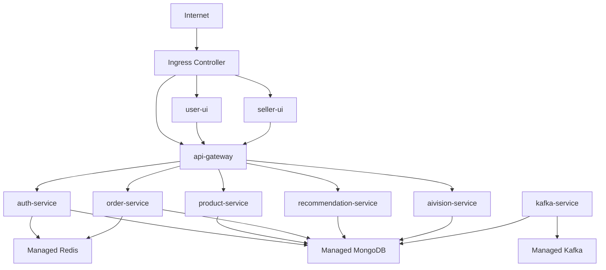

# Kubernetes Deployment Guide

## Purpose

This document explains how Artistry Cart should be deployed on Kubernetes once the repository is fully containerized.

It focuses on:

- workload mapping
- cluster resource design
- configuration and secrets
- ingress and service discovery
- scaling, rollout, and operational safety

## Scope

This guide covers the stateless application layer inside Kubernetes:

- `user-ui`
- `seller-ui`
- `api-gateway`
- `auth-service`
- `product-service`
- `order-service`
- `recommendation-service`
- `aivision-service`
- `kafka-service`

The repository now includes a Phase 5 Kubernetes baseline under:

- [k8s/README.md](</C:/Users/adity/Desktop/Artistry Cart/artistry-cart/k8s/README.md>)
- [k8s/base](</C:/Users/adity/Desktop/Artistry Cart/artistry-cart/k8s/base>)
- [k8s/overlays](</C:/Users/adity/Desktop/Artistry Cart/artistry-cart/k8s/overlays>)
- [k8s/addons/monitoring](</C:/Users/adity/Desktop/Artistry Cart/artistry-cart/k8s/addons/monitoring>)

It does not recommend self-hosting all stateful infrastructure in-cluster for production. For production, managed services remain the preferred direction for:

- MongoDB
- Redis
- Kafka

## Recommended Topology



## Environment Layout

The repo-level plan already points toward a base-and-overlay structure. Kubernetes manifests should follow that shape.

Recommended layout:

```text
k8s/
  base/
    namespace.yaml
    configmap.yaml
    secrets.example.yaml
    user-ui/
    seller-ui/
    api-gateway/
    auth-service/
    product-service/
    order-service/
    recommendation-service/
    aivision-service/
    kafka-service/
    product-cleanup-cronjob/
  overlays/
    dev/
    staging/
    production/
```

Recommended tool choice:

- Kustomize first

Why:

- it fits cleanly with the proposed base/overlay structure
- it is enough for this platform before Helm complexity is necessary

## Namespace Strategy

Recommended namespaces:

- `artistry-cart-dev`
- `artistry-cart-staging`
- `artistry-cart-prod`

This keeps environment boundaries clear and makes policy, secrets, and rollbacks easier to reason about.

## Workload Mapping

Recommended Kubernetes resource model by workload:

| Component | Workload kind | Service kind | Public or internal | Scaling notes |
| --- | --- | --- | --- | --- |
| `user-ui` | `Deployment` | `ClusterIP` | public via Ingress | horizontally scalable |
| `seller-ui` | `Deployment` | `ClusterIP` | public via Ingress | horizontally scalable |
| `api-gateway` | `Deployment` | `ClusterIP` | public via Ingress | strong HPA candidate |
| `auth-service` | `Deployment` | `ClusterIP` | internal | HPA candidate |
| `product-service` | `Deployment` | `ClusterIP` | internal | scale carefully until cron is separated |
| `order-service` | `Deployment` | `ClusterIP` | internal | HPA candidate |
| `recommendation-service` | `Deployment` | `ClusterIP` | internal | heavier CPU and memory profile |
| `aivision-service` | `Deployment` | `ClusterIP` | internal | may split into API + worker later |
| `kafka-service` | `Deployment` | none or `ClusterIP` if needed | internal | scale from Kafka lag |
| product cleanup job | `CronJob` | none | internal | should move out of `product-service` API |

## Public Entry Model

Recommended public hosts:

- `app.<domain>` -> `user-ui`
- `seller.<domain>` -> `seller-ui`
- `api.<domain>` -> `api-gateway`

Recommended Ingress behavior:

- TLS termination at the ingress controller
- host-based routing to frontends and gateway
- no direct public ingress to internal services

## Internal Service Discovery

Inside the cluster, services should resolve by Kubernetes DNS names such as:

- `http://auth-service:6001`
- `http://product-service:6002`
- `http://order-service:6004`
- `http://recommendation-service:6005`
- `http://aivision-service:6006`

This is why the gateway must move away from hardcoded localhost upstreams before production deployment.

## Configuration Model

Non-secret configuration should live in `ConfigMap`s. Sensitive configuration should live in `Secret`s.

### Good `ConfigMap` candidates

- service URLs
- feature flags
- port values
- log level
- CORS origin lists
- public frontend URLs

### Good `Secret` candidates

- `DATABASE_URL`
- `REDIS_URL`
- Stripe keys
- OAuth client secrets
- SMTP credentials
- Google AI and Hugging Face keys
- ImageKit private key
- JWT secrets

## Probe Standards

Every HTTP workload should expose:

- `livenessProbe`
- `readinessProbe`

Recommended target endpoints:

- `/healthz`
- `/readyz`

Special probe notes:

- `aivision-service` may also benefit from `startupProbe` because of heavier initialization
- `api-gateway` readiness should confirm the app is ready to accept traffic, but should not become a full dependency fan-out test

## Resource Request And Limit Guidance

These are starting points, not final numbers. Real values should be tuned with measurement.

| Workload | CPU request | Memory request | Notes |
| --- | --- | --- | --- |
| `user-ui` | `100m` | `256Mi` | moderate SSR footprint |
| `seller-ui` | `100m` | `256Mi` | similar to `user-ui` |
| `api-gateway` | `100m` | `256Mi` | lightweight but central |
| `auth-service` | `150m` | `256Mi` | moderate API load |
| `product-service` | `200m` | `384Mi` | product and search routes |
| `order-service` | `200m` | `384Mi` | Stripe and order logic |
| `recommendation-service` | `300m` | `512Mi` | TensorFlow-related headroom |
| `aivision-service` | `500m` | `1Gi` | likely heaviest API |
| `kafka-service` | `150m` | `256Mi` | depends on event volume |

Limits can start around 2x to 3x the request values and be tuned after load testing.

## Scaling Strategy

### Good HPA candidates

- `api-gateway`
- `auth-service`
- `order-service`
- `recommendation-service`
- `aivision-service`
- frontends

### Special handling

`product-service`

- should not scale freely while the in-process cron job remains part of the API container
- move cleanup logic to a dedicated `CronJob` first

`kafka-service`

- scale from queue depth or Kafka consumer lag
- KEDA is a strong fit here once Kafka lag metrics are available

`aivision-service`

- long-term best shape is separate API and worker deployments

## Rollout Strategy

Recommended rollout order:

1. frontends
2. gateway
3. core APIs
4. AI and analytics workers

Recommended rollout settings:

- rolling updates for stateless Deployments
- `maxUnavailable: 0` for critical entry services where practical
- `PodDisruptionBudget` for `api-gateway`, `user-ui`, and `seller-ui`

## Stateful Infrastructure Guidance

For production, prefer managed services rather than in-cluster StatefulSets for:

- MongoDB
- Redis
- Kafka

Why:

- backup and restore are easier
- upgrades are safer
- the app cluster stays simpler
- operator burden is lower

For local development or demos, in-cluster or Compose-based stateful services are fine.

## Security Guidance

Baseline Kubernetes security rules:

- run workloads as non-root
- avoid privileged containers
- keep secrets in Kubernetes Secrets or an external secret manager
- use per-namespace separation by environment
- introduce `NetworkPolicy` as the platform matures
- restrict egress for sensitive workloads where practical

Current repo status:

- baseline container `securityContext` is already present in the workload manifests
- Prometheus scrape annotations are already present for the main backend services
- baseline `NetworkPolicy` resources are already included in `k8s/base/network-policies.yaml`
- the next security step is stronger secret management, egress control, and admission policy enforcement

## Observability Expectations

The repo now supports a Phase 6 observability baseline:

- shared structured logs at the service runtime layer
- `/metrics` endpoints on the main backend services
- Kafka worker health, readiness, and metrics
- Prometheus scrape annotations in Kubernetes

Before calling the deployment fully production-ready, the platform should also support:

- pod and container metrics
- HTTP error rate tracking
- restart and readiness alerting
- consumer lag monitoring for `kafka-service`

Nice early wins:

- central log aggregation
- Prometheus-compatible metrics
- dashboarding for gateway, order flows, AI workloads, and worker lag
- tracing from `api-gateway` into internal services

## High-Risk Areas To Address Before Production

- frontend `NEXT_PUBLIC_*` values still need disciplined build-time and runtime coordination across environments
- `product-service` now supports a Kubernetes CronJob pattern, but long-term cleanup logic should move to a more dedicated maintenance path or worker
- `aivision-service` still mixes API and Agenda worker behavior
- the baseline uses a shared Kubernetes secret for simplicity; production hardening should move toward narrower secret ownership or an external secret manager
- environment variable naming still includes the repo-specific `STRIPE_SECRETE_KEY` convention, which should be normalized carefully later

## Suggested Deployment Sequence

1. containerize and verify all workloads in Docker
2. standardize health endpoints and env-driven service URLs
3. deploy frontends, gateway, and core APIs to a non-production namespace
4. add Kafka worker and AI workloads
5. separate scheduled jobs from API pods
6. add HPA, PDB, and observability
7. promote the same image set into production

## Definition Of Done

The Kubernetes deployment design is in good shape when:

- every workload has a clear Kubernetes resource owner
- only frontends and gateway are publicly exposed
- internal services resolve by service name
- configuration and secrets are separated cleanly
- workloads can scale without duplicating background job side effects
- rollouts and restarts can happen without avoidable downtime

## Related Docs

- [DevOps Implementation Plan](</C:/Users/adity/Desktop/Artistry Cart/artistry-cart/docs/DevOps/DevOps-implemenatation.md>)
- [Docker Compose Strategy](</C:/Users/adity/Desktop/Artistry Cart/artistry-cart/docs/DevOps/docker-compose-strategy.md>)
- [Dockerfile Standards](</C:/Users/adity/Desktop/Artistry Cart/artistry-cart/docs/DevOps/dockerfile-standards.md>)
- [CI/CD Release Pipeline](</C:/Users/adity/Desktop/Artistry Cart/artistry-cart/docs/DevOps/ci-cd-release-pipeline.md>)
- [DevOps Learning Guide](</C:/Users/adity/Desktop/Artistry Cart/artistry-cart/docs/DevOps/learning-guide/README.md>)
- [Service Topology](</C:/Users/adity/Desktop/Artistry Cart/artistry-cart/docs/02-architecture/service-topology.md>)
