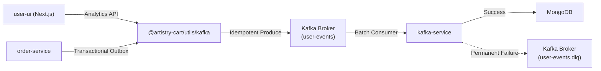

# Kafka Production Architecture

This document describes the architectural guarantees, standards, and flow of the Kafka event pipeline in the Artistry Cart ecosystem.

## 🏗 Topology & Flow

## 🛡️ Reliability Guarantees

### 1. Idempotent Producer
The shared KafkaJS producer (`packages/utils/kafka/analytics-producer.ts`) operates with `idempotent: true` and `maxInFlightRequests: 5`.
**Why?** If a network timeout occurs after the broker receives a message but before it sends the ACK, the producer will automatically retry. Idempotency guarantees the broker will recognize the retry sequence and silently discard the duplicate, ensuring **Exactly-Once** production semantics.

### 2. Transactional Outbox Pattern
Services like `order-service` do not write to Kafka during the main database transaction. Instead, they write an event to an `Outbox` table. A background cron job polls this table and uses the idempotent producer to publish.
**Why?** This prevents the "Dual Write" problem. If the DB commits but Kafka is down, the event is not lost—it sits in the Outbox and will be published when Kafka recovers.

### 3. Exponential Backoff & Connection Resilience
Both the `kafka-service` consumer and the shared producer employ exponential backoff with jitter on startup and connection drops.
- Producer will retry 5 times before failing a web request.
- Consumer will retry infinitely on network loss, and 5 times on initial startup failure.

## 📏 Schema Evolution & Contracts

All Kafka payloads are validated using Zod schemas defined in `analytics-contract.ts`.

- **Versioning**: Every event includes a `schemaVersion` header. The consumer maintains a `SUPPORTED_SCHEMA_VERSIONS` array.
- **Correlation**: A `correlationId` header is propagated from the API Gateway/Next.js frontend all the way down to the consumer logs, enabling distributed tracing of a single user request.

## 💀 Dead Letter Queue (DLQ)

If the `kafka-service` encounters a malformed payload (e.g., fails Zod validation) or a permanent processing error, the event is **not** infinitely retried (which would cause head-of-line blocking).

Instead, it is stripped of its original topic routing, enriched with error metadata, and published to the `user-events.dlq` topic. The consumer then commits the offset and continues processing.

## 📈 Observability & Monitoring

The `kafka-service` exposes a `/metrics` endpoint (Prometheus format) detailing the health of the pipeline:

- `kafka_consumer_lag`: The most critical metric. If this number grows continuously, the consumer is slower than the producer and requires horizontal scaling (more partitions + more pod replicas).
- `kafka_batch_duration_seconds`: Histogram measuring the processing time for a batch.
- `kafka_events_dead_lettered_total`: Alerts should fire if this counter spikes, indicating a schema mismatch deployment.
