# Artistry Cart — Interview Preparation Script

> This script is structured as a full walkthrough of the Artistry Cart project. Each section has:
> - **What the interviewer wants to hear** — the intent behind the question
> - **Your answer script** — what to say, explained from first principles
> - **Mermaid diagrams** — visual aids with walkthroughs
> - **Code references** — exact files to cite if asked "show me where"

---

## 1. Why Did You Build It?

### What The Interviewer Wants To Hear
They want to know if you can **identify a real problem** and if you built this to learn or to solve something meaningful. They're also gauging whether you think about users, not just technology.

### Your Answer

> I built Artistry Cart because I wanted to solve a real problem while learning production-grade engineering patterns.
>
> The problem: Artisan creators — people who make handmade jewelry, custom art, crafts — don't have a good e-commerce platform. Generic platforms like Amazon or Shopify aren't designed for their workflow. They need shop pages that tell their story, AI-assisted product visualization, event-based sales (craft fairs, seasonal), and flexible discount structures.
>
> I chose this problem specifically because it naturally requires interesting engineering: **multiple user personas** (buyers and sellers), **payment flows** with Stripe, **event-driven analytics**, **AI capabilities** for product generation and visual search, and **multi-service architecture** to handle different domains at different scales.
>
> It's not a tutorial project. It has production features: webhook-verified payments, OAuth, rate limiting, graceful shutdown, Prometheus metrics, Kubernetes manifests, and a full CI/CD pipeline.

---

## 2. Problem Statement

### What The Interviewer Wants To Hear
Can you articulate the problem clearly, identify the stakeholders, and describe the core user flows?

### Your Answer

> Artistry Cart serves **two personas** with fundamentally different needs:
>
> **Buyers** want to: discover artisan products, search visually, add to cart/wishlist, checkout securely, track orders, and get personalized recommendations.
>
> **Sellers** want to: onboard their shop, manage products with pricing and images, create time-bound events and discount codes, track orders and earnings, request payouts, and use AI to generate product concepts.
>
> The **core flows** are:
> 1. **Discovery** → Browse, search, AI-powered visual search
> 2. **Purchase** → Cart → Checkout → Stripe payment → Order tracking
> 3. **Seller Operations** → Product management → Order fulfillment → Earnings/payouts
> 4. **Analytics** → User activity captured asynchronously → Materialized into recommendation data

### Persona Flow Diagram

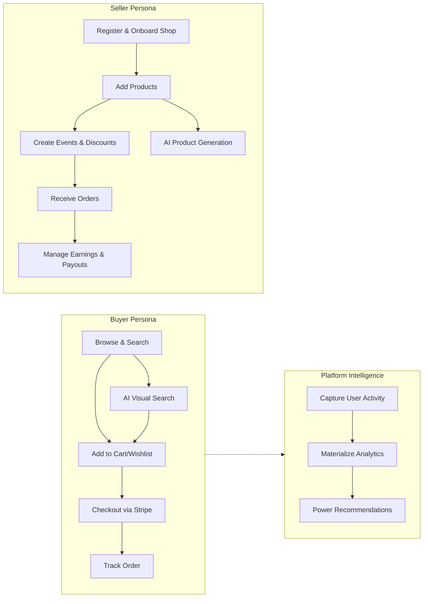

> **Walkthrough**: The buyer flow is left-to-right — discovery through purchase. The seller flow is top-down — onboarding through earnings. Both feed into the platform intelligence layer, where user activity events are captured asynchronously through Kafka and materialized for recommendations.

---

## 3. Architecture

### What The Interviewer Wants To Hear
This is the most important section. They want to see that you can **explain architectural decisions**, not just list technologies. Why microservices? Why this split? Why not just a monolith?

### Your Answer

> The architecture is a **service-oriented monorepo** — multiple independently deployable services living in one Nx-managed repository. It's not a pure microservices architecture (we share a database), but it's not a monolith either. I'll explain why.

### High-Level Architecture

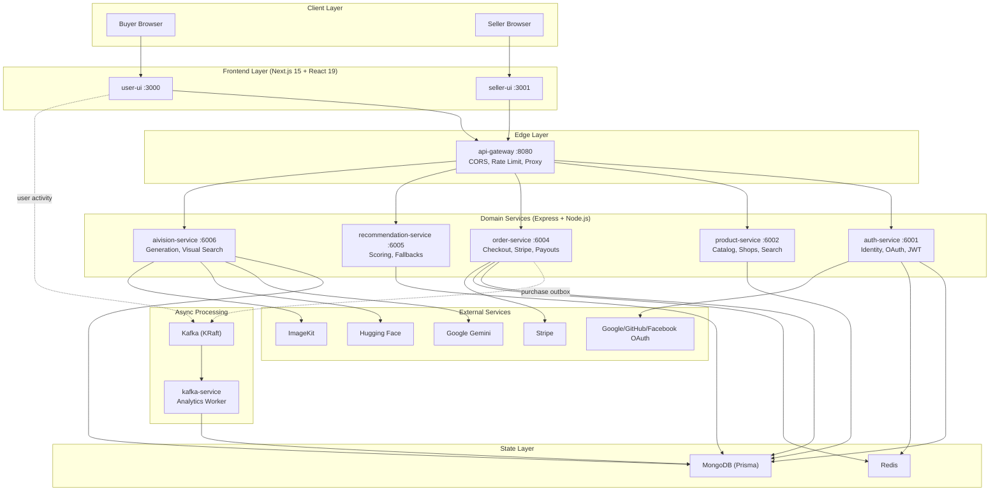

> **Walkthrough — Read this diagram in layers:**
>
> **Layer 1 — Clients & Frontends**: Two separate Next.js apps for two personas. This is intentional — a buyer's UX (browsing, visual search, checkout) has nothing in common with a seller's UX (dashboard, product management, earnings). Separate apps mean separate deployment and independent UX evolution.
>
> **Layer 2 — Edge (API Gateway)**: Every backend request goes through one entry point. The gateway handles CORS, rate limiting, request ID generation, and proxies to the correct service. It does NOT do business logic — it's a thin routing layer.
>
> **Layer 3 — Domain Services**: Each service owns a business domain. The splits follow **fault isolation boundaries**:
> - Auth is isolated because identity has its own security surface
> - Orders are isolated because payment bugs shouldn't crash the catalog
> - AI Vision is isolated because AI workloads have fundamentally different latency and scaling characteristics
>
> **Layer 4 — Async Processing**: User activity events flow through Kafka to a dedicated worker that materializes analytics. This is intentionally asynchronous — a buyer clicking "view product" should not wait for analytics to finish writing.
>
> **Layer 5 — State**: All services share one MongoDB through Prisma. This is the biggest architectural tradeoff (we'll discuss why in Section 8).

### Why Not A Monolith?

> A monolith would be simpler, but:
> - AI workloads (Gemini, embedding computation) would compete for CPU with checkout
> - A bug in discount calculation shouldn't bring down auth
> - Kafka consumer lag shouldn't affect buyer-facing latency
> - Different parts of the system scale differently
>
> But I didn't go full microservices either — I kept a shared database because at this scale, the development velocity gain of a shared Prisma schema outweighs the coupling cost.

### Request Flow Detail

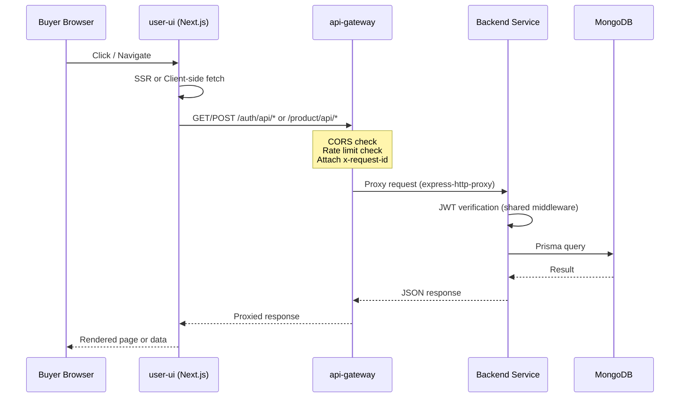

> **Walkthrough**: Every request follows this exact path. The key insight is that **security is layered**:
> 1. The gateway enforces rate limits and CORS
> 2. Each service independently verifies JWTs using shared middleware
> 3. Role guards (`isSeller`, `isUser`) enforce authorization after authentication
> 
> The gateway doesn't verify tokens — it just routes. This means services can function independently in tests without the gateway.

---

## 4. Database Design

### What The Interviewer Wants To Hear
They want to understand your **data modeling decisions**, how you handle relationships in a document database, and whether you understand the tradeoffs of your schema design.

### Your Answer

> I use MongoDB with Prisma ORM. The schema has **~35 models** organized into 6 bounded contexts, even though they all live in one database.

### Data Model Map

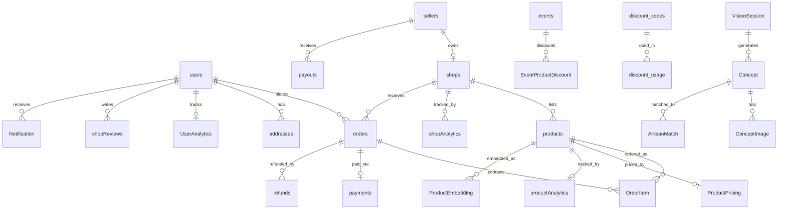

> **Walkthrough — Bounded contexts in this diagram:**
>
> | Context | Key Models | Owning Service |
> | --- | --- | --- |
> | **Identity** | `users`, `sellers`, `addresses` | auth-service |
> | **Catalog** | `products`, `shops`, `ProductPricing`, `events`, `discount_codes` | product-service |
> | **Orders** | `orders`, `OrderItem`, `payments`, `payouts`, `refunds` | order-service |
> | **Analytics** | `UserAnalytics`, `productAnalytics`, `shopAnalytics`, `analyticsOutbox` | kafka-service (write), recommendation-service (read) |
> | **AI Vision** | `VisionSession`, `Concept`, `ConceptImage`, `ProductEmbedding` | aivision-service |
>
> **Key design decisions:**
> - `password` on `users` is **optional** (`String?`) — because OAuth users don't have passwords
> - `OrderItem` stores `price` and `originalPrice` at time of purchase — this is **point-in-time snapshotting**. If a seller changes their price later, existing orders don't change.
> - `analyticsOutbox` implements the **Transactional Outbox Pattern** — events are written to the DB first, then a background process publishes to Kafka. This solves the dual-write problem.
> - Analytics models (`UserAnalytics`) use MongoDB's flexible `Json` fields for action history arrays, since the shape evolves.

### Why Shared Database?

> This is the most common follow-up. The honest answer:
>
> **Pros**: One `prisma generate`. One MongoDB instance locally. No distributed transactions. Consistent types across services. Dramatically faster development.
>
> **Cons**: Services can accidentally read each other's data. Schema migrations need coordination. True service independence is logical, not physical.
>
> **Mitigation**: Code ownership boundaries are documented. Each service only imports the models it owns. The Prisma schema file has comments marking which service owns which models.

---

## 5. Authentication

### What The Interviewer Wants To Hear
They want to know if you understand **security fundamentals**: token lifecycle, cookie security, OAuth flows, and how auth propagates across services.

### Your Answer

> The auth system supports two strategies: **email/password with JWT** and **OAuth 2.0 with Google, GitHub, and Facebook**.

### Authentication Flow

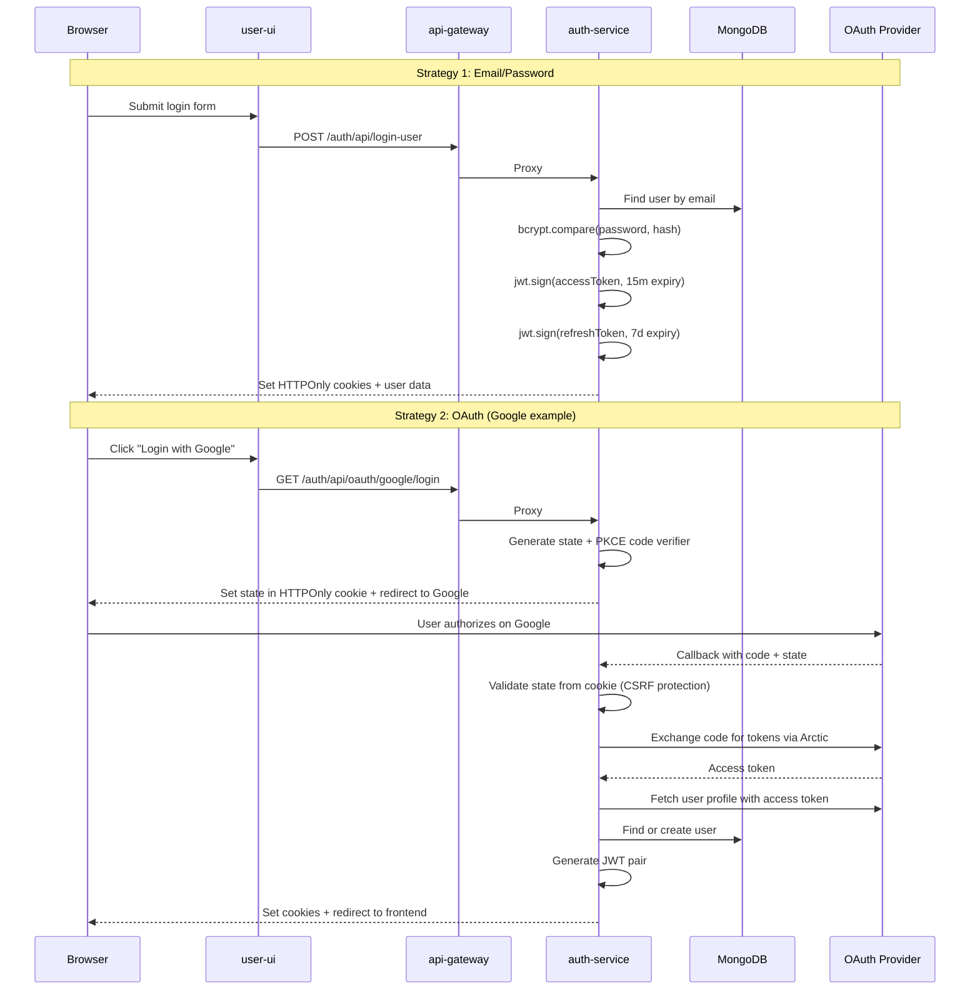

> **Walkthrough — key security decisions:**
>
> **HTTPOnly cookies**: Tokens are stored in `httpOnly: true` cookies, not localStorage. This prevents XSS attacks from stealing tokens. The cookie settings also adapt: `secure: true` and `sameSite: "none"` in production, `sameSite: "lax"` in development.
>
> **Short-lived access tokens**: Access tokens expire in **15 minutes**. Refresh tokens last **7 days**. When the access token expires, the frontend calls `/auth/api/refresh-token`, which verifies the refresh token, looks up the user in the DB, and issues a new pair.
>
> **OAuth CSRF protection**: Before redirecting to Google/GitHub/Facebook, the server generates a random `state` parameter and stores it in an HTTPOnly cookie. When the OAuth provider calls back, the server compares the callback state with the cookie value. If they don't match, the request is rejected.
>
> **PKCE (Proof Key for Code Exchange)**: Google OAuth uses PKCE — a `code_verifier` is generated and stored in a cookie, and the `code_challenge` is sent to Google. This prevents authorization code interception attacks.

### Token Verification Across Services

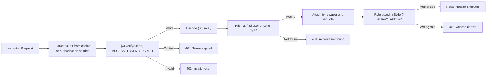

> **Walkthrough**: This is the `isAuthenticated` middleware in [packages/middleware/isAuthenticated.ts](file:///c:/Users/adity/Desktop/Artistry%20Cart/artistry-cart/packages/middleware/isAuthenticated.ts). It's a **shared package** — every service uses the same middleware. The token carries `{ id, role }` where role is either `"user"` or `"seller"`. After verification, the middleware does a DB lookup to hydrate the full user/seller object onto `req.user`.

---

## 6. APIs

### What The Interviewer Wants To Hear
They want to know how your services communicate, what your API design looks like, and whether you've thought about API contracts.

### Your Answer

> All inter-service communication for the request path goes through the **API Gateway**, which is a simple Express proxy. There's no service-to-service communication — if `order-service` needs user data, it queries the shared database directly (tradeoff of shared persistence).

### Gateway Routing Map

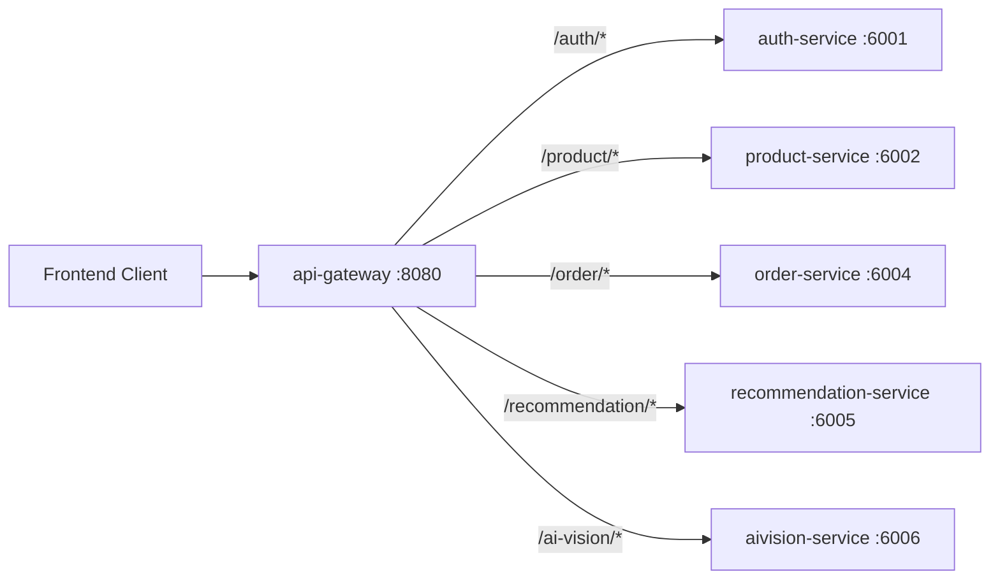

> **Key API design patterns**:
>
> **1. Gateway as a thin router**: The gateway uses `express-http-proxy` — it forwards the entire request including cookies, headers, and body. It doesn't transform anything. This keeps it simple and debuggable.
>
> **2. RESTful conventions**: Routes follow `/{service}/api/{resource}/{action}` patterns. Examples:
> - `POST /auth/api/login-user` — login
> - `GET /product/api/get-products` — list products
> - `POST /order/api/create-payment-session` — start checkout
> - `GET /recommendation/api/recommendations` — get recommendations
>
> **3. Stripe webhooks bypass JSON parsing**: The webhook route is mounted **before** `express.json()` in [order-service/main.ts](file:///c:/Users/adity/Desktop/Artistry%20Cart/artistry-cart/apps/order-service/src/main.ts). This preserves the raw body needed for `stripe.webhooks.constructEvent()` signature verification.
>
> **4. Shared error handling**: All services use `@artistry-cart/error-handler` which provides typed error classes (`AppError`, `AuthError`, `ValidationError`, `PrismaError`) and a unified error middleware that formats errors consistently.

---

## 7. Deployment

### What The Interviewer Wants To Hear
They want to see that you've thought about the **full lifecycle** — from local development to production deployment.

### Your Answer

### Deployment Pipeline

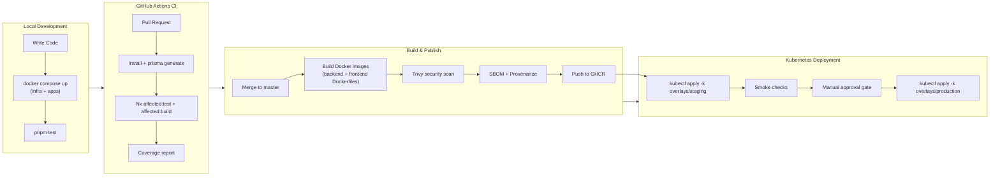

> **Walkthrough**:
>
> **Local**: `docker compose -f docker/compose/docker-compose.infra.yml up -d` starts MongoDB, Redis, Kafka (KRaft mode), and Redpanda Console. Then services run via `pnpm exec nx serve <service-name>`.
>
> **CI**: GitHub Actions uses **Nx affected** to only test and build what changed — if I modify `auth-service`, it doesn't rebuild `aivision-service`. This keeps CI fast.
>
> **Image publishing**: Two Dockerfiles — one for backend services, one for frontends. Both use multi-stage builds. The build argument `APP_NAME` determines which service gets built. Images are scanned with Trivy and published to GHCR with SBOM and provenance attestations.
>
> **Kubernetes**: Uses **Kustomize** with three overlays (dev, staging, production). The base manifests define Deployments, Services, ConfigMaps, NetworkPolicies, and Ingress. Only `user-ui`, `seller-ui`, and `api-gateway` are public — everything else is `ClusterIP`.

### Kubernetes Topology

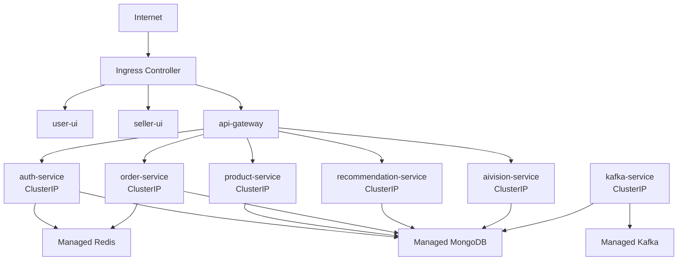

> **Key production decisions**: In production, stateful infrastructure (MongoDB, Redis, Kafka) is **managed** — not self-hosted in the cluster. The application workloads run in Kubernetes with non-root containers, dropped capabilities, and seccomp profiles.

---

## 8. Tradeoffs

### What The Interviewer Wants To Hear
This is where you show **engineering maturity**. They want to hear you talk honestly about decisions, not pretend everything is perfect.

### Your Answer

> Every architecture has tradeoffs. Here are the five most significant ones I made:

### Tradeoff Map

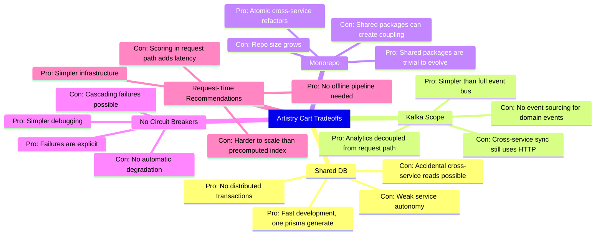

> **How I'd discuss each one**:
>
> 1. **Shared DB vs database-per-service**: "I chose shared persistence because the development velocity gain at this scale far outweighs the coupling cost. I mitigate it through code ownership conventions and documented model boundaries. If the project scaled to multiple teams, I'd split databases using MongoDB's multi-database support."
>
> 2. **Kafka for analytics only**: "I deliberately limited Kafka to analytics. Adding Kafka for domain events (like 'order.created') would mean managing eventual consistency, sagas, and compensating transactions — a level of complexity that doesn't pay off at current scale."
>
> 3. **No circuit breakers**: "The gateway proxies directly to services without circuit breakers. If `auth-service` is down, requests fail immediately. I chose this because at current scale, explicit failures are easier to debug than automatic degradation. In production at scale, I'd add opossum or a similar library."

---

## 9. Biggest Challenge

### What The Interviewer Wants To Hear
They want a **real story** about a technical problem you solved, how you debugged it, and what you learned.

### Your Answer

> The hardest engineering problem was **the dual-write problem in analytics**.

### The Problem Explained

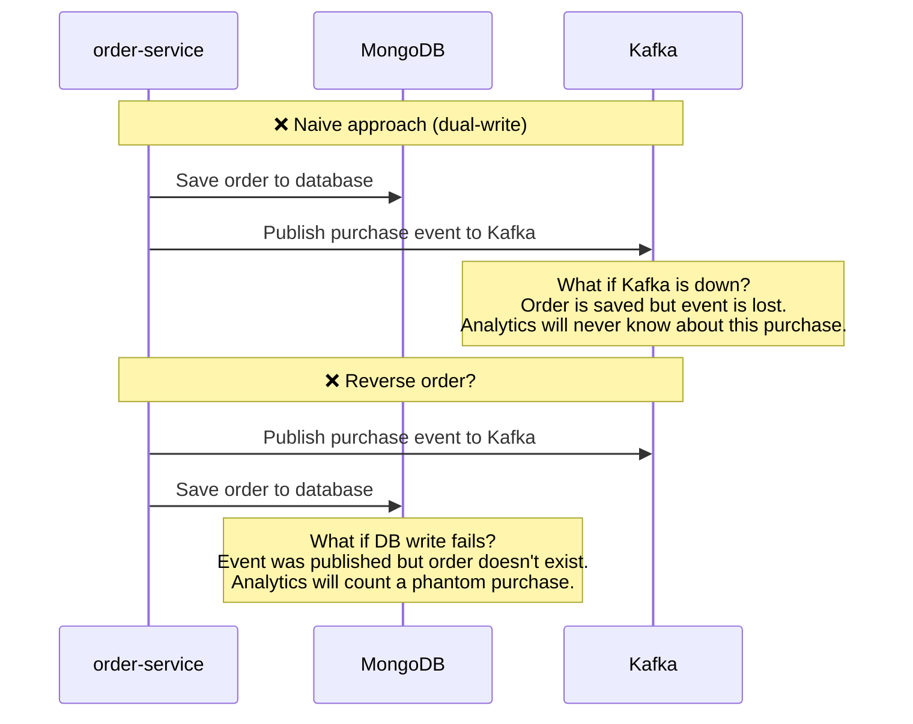

> **Walkthrough**: The problem is that you can't atomically write to both a database and a message broker. If you write to the DB first and Kafka fails, the event is lost. If you write to Kafka first and the DB fails, you have a phantom event. This is the **dual-write problem** — one of the most common distributed systems challenges.

### The Solution: Transactional Outbox Pattern

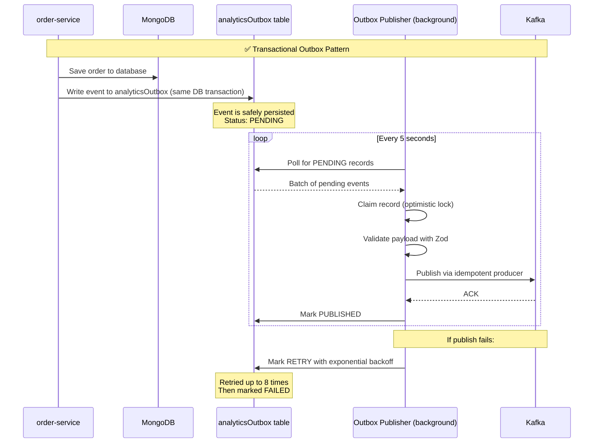

> **Walkthrough**: The solution is the Transactional Outbox Pattern, implemented in [order-service/services/analytics-outbox.ts](file:///c:/Users/adity/Desktop/Artistry%20Cart/artistry-cart/apps/order-service/src/services/analytics-outbox.ts):
>
> 1. When a purchase happens, the order and the analytics event are written to the **same database** — the order to the `orders` collection, the event to the `analyticsOutbox` collection. Since both writes go to the same MongoDB, they're atomic.
> 2. A background publisher polls the outbox every 5 seconds, claims pending records with an optimistic lock (preventing duplicate processing), validates them with Zod, and publishes to Kafka using the idempotent producer.
> 3. If publication fails, the record gets exponential backoff (`1s → 2s → 4s → ... → 5min`) up to 8 attempts, then it's marked `FAILED`.
> 4. Stale locks (records stuck in `PROCESSING` for over 60 seconds) are automatically released.
>
> This was the hardest challenge because it required understanding **distributed systems guarantees** — you can't have exactly-once across two systems, but you can get effectively-once by combining an outbox with an idempotent producer.

---

## 10. Performance Optimization

### What The Interviewer Wants To Hear
They want specific, measurable optimizations — not vague claims about "making it faster."

### Your Answer

### Performance Strategy Map

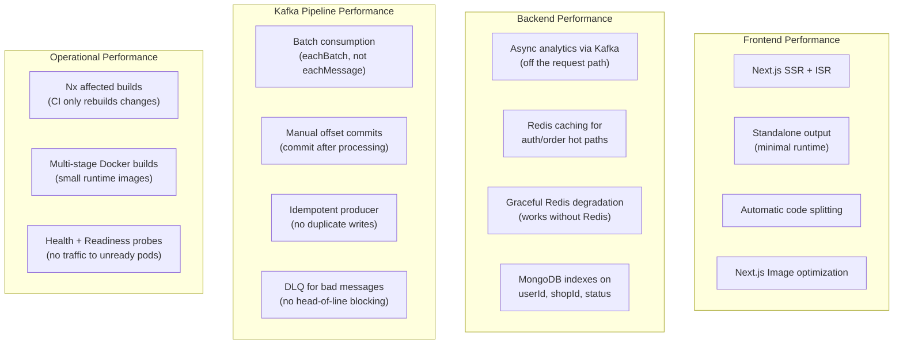

> **Key optimizations to discuss:**
>
> 1. **Analytics off the request path**: When a buyer views a product, the analytics event goes to Kafka — not to a database call in the same request. This means the "view product" API responds in milliseconds, and analytics processing happens asynchronously.
>
> 2. **Batch consumption**: `kafka-service` uses `eachBatch` mode, not `eachMessage`. This means it processes events in batches and commits offsets once per batch, reducing the number of broker roundtrips.
>
> 3. **DLQ prevents head-of-line blocking**: If one bad event fails Zod validation, it goes to the dead-letter queue immediately. Without a DLQ, one malformed event would block all subsequent events in the partition.
>
> 4. **Redis with graceful degradation**: Redis is used for caching in auth and order flows, but the system works without it. If Redis is down, it falls back to direct database queries. This is better than crashing.
>
> 5. **Database indexes**: The Prisma schema has `@@index` on fields used in queries: `orders.userId`, `orders.shopId`, `orders.status`, `addresses.userId`.

---

## 11. Security

### What The Interviewer Wants To Hear
They want to know you understand **defense in depth** — multiple layers of security, not just one.

### Security Layers

```mermaid
flowchart TB
    subgraph Layer1["Layer 1: Transport"]
        CORS["CORS with explicit origins"]
        RateLimit["Rate limiting (per-IP)"]
        Headers["Security headers"]
        TLS["HTTPS in production"]
    end

    subgraph Layer2["Layer 2: Authentication"]
        JWT["JWT verification on every request"]
        HTTPOnly["HTTPOnly + Secure cookies"]
        ShortLived["15-minute access tokens"]
        RefreshRotation["Refresh token rotation"]
        OAuthState["OAuth state + PKCE"]
    end

    subgraph Layer3["Layer 3: Authorization"]
        RoleGuards["isSeller / isUser / isAdmin guards"]
        OwnerCheck["Ownership checks in controllers"]
        AIRateLimit["AI Vision per-route rate limiting"]
    end

    subgraph Layer4["Layer 4: Payment Security"]
        WebhookSig["Stripe webhook signature verification"]
        RawBody["Raw body parsing before JSON"]
        Idempotent2["Idempotent event processing"]
    end

    subgraph Layer5["Layer 5: Infrastructure"]
        NonRoot["Non-root containers"]
        Capabilities["Dropped Linux capabilities"]
        Seccomp["Seccomp runtime default"]
        NetworkPolicy["Kubernetes NetworkPolicies"]
        Trivy["Trivy image + filesystem scans"]
        Dependabot["Dependabot for dependency updates"]
    end

    Layer1 --> Layer2 --> Layer3 --> Layer4 --> Layer5
```

> **Walkthrough — the most important security decisions:**
>
> **Cookie security**: Tokens are stored in HTTPOnly cookies — JavaScript cannot read them. In production: `secure: true` (HTTPS only), `sameSite: "none"` (cross-site allowed for API-frontend split). The `setCookie` utility adapts automatically based on `NODE_ENV`.
>
> **Stripe webhook verification**: The Stripe webhook route is mounted BEFORE `express.json()` middleware. This is critical — `stripe.webhooks.constructEvent()` needs the **raw request body** to verify the signature. If JSON parsing runs first, the body is modified and signature verification fails. This is a common production mistake.
>
> **OAuth CSRF protection**: OAuth state is stored in an HTTPOnly cookie (not in the URL or localStorage). The callback validates that the returned state matches the cookie. This prevents CSRF attacks where an attacker initiates an OAuth flow and tricks the user into completing it.

---

## 12. Testing

### What The Interviewer Wants To Hear
They want to see a **testing strategy**, not just "I wrote tests."

### Testing Pyramid

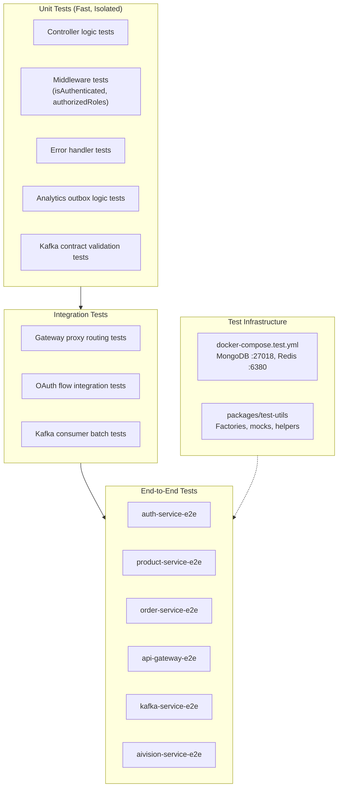

> **Key testing patterns:**
>
> **Shared test utilities**: `packages/test-utils` provides mock factories, auth helpers, request helpers, and shared setup. This prevents every service from reinventing test infrastructure.
>
> **Isolated test databases**: E2E tests use `docker-compose.test.yml` which starts MongoDB on port `27018` and Redis on `6380` — completely separate from development databases.
>
> **Nx workspace testing**: The root `vitest.config.mjs` includes all service test suites. `pnpm test` runs everything. `pnpm test:auth` runs only auth tests. CI uses `nx affected:test` to only run tests affected by the change.
>
> **OAuth unit testing**: OAuth controllers are tested by mocking the Arctic library providers. The tests verify state generation, CSRF validation, user creation/update, and token generation without calling real OAuth providers.

---

## 13. What Would You Improve?

### What The Interviewer Wants To Hear
This is a maturity check. They want to see that you can **critically evaluate your own work** and prioritize improvements.

### Your Answer

### Improvement Roadmap

```mermaid
flowchart LR
    subgraph P1["Priority 1: Resilience"]
        CB["Add circuit breakers<br/>to gateway proxies"]
        Retry["HTTP retry with<br/>exponential backoff"]
        Timeout["Per-route timeouts"]
    end

    subgraph P2["Priority 2: Observability"]
        Tracing["Distributed tracing<br/>(OpenTelemetry)"]
        Alerting["Consumer lag alerting<br/>rules in Prometheus"]
        Dashboard["Grafana dashboards<br/>per service"]
    end

    subgraph P3["Priority 3: Scale"]
        SplitDB["Split databases<br/>per service"]
        PrecomputedReco["Precomputed recommendation<br/>index (offline pipeline)"]
        SplitAIWorker["Split aivision-service<br/>API vs background jobs"]
    end

    subgraph P4["Priority 4: Developer Experience"]
        FrontendTests["Frontend automated tests"]
        SchemaRegistry["Kafka schema registry"]
        EventReplay["Event replay tooling"]
    end

    P1 --> P2 --> P3 --> P4
```

> **How to discuss each:**
>
> **Circuit breakers (Priority 1)**: "Right now, if auth-service goes down, all auth requests fail immediately. Adding `opossum` circuit breakers would let the gateway detect the failure pattern and fail fast without even attempting the request, reducing latency during outages."
>
> **Distributed tracing (Priority 2)**: "We already have correlation IDs in the Kafka pipeline and request IDs from the gateway. The next step is full OpenTelemetry integration so we can trace a request from the browser through the gateway, service, and database."
>
> **Database splitting (Priority 3)**: "The shared database works today, but if this were a multi-team project, I'd split into per-service databases. MongoDB makes this feasible — each service could have its own database on the same cluster initially, then migrate to separate clusters."
>
> **Precomputed recommendations (Priority 3)**: "Currently, recommendations are scored at request time. At scale, I'd move to an offline pipeline that precomputes recommendation scores and stores them in a fast lookup (Redis or Elasticsearch), reducing API latency."

---

## Quick Reference: Common Follow-up Questions

| Question | Key Point |
| --- | --- |
| "Why not use GraphQL?" | REST is simpler for this use case. Each service has clear resource boundaries. GraphQL adds resolver complexity without proportional benefit for this API surface. |
| "Why MongoDB and not Postgres?" | Schema flexibility for analytics (Json fields), natural fit for document-shaped product data (variants, images, options), and simpler horizontal scaling. |
| "How do you handle distributed transactions?" | We don't — that's the benefit of a shared database. The one case that needs cross-system atomicity (purchase → analytics) uses the Transactional Outbox Pattern. |
| "What happens if Kafka goes down?" | Analytics events accumulate in the outbox table. When Kafka recovers, the publisher drains the backlog. User-facing flows (browsing, checkout) are unaffected because Kafka is not in the request path. |
| "How do you prevent duplicate analytics?" | Three layers: (1) idempotent Kafka producer prevents duplicate writes, (2) outbox optimistic locking prevents duplicate publishing, (3) consumer deduplication via eventId. |
| "Why two separate frontends?" | Buyer and seller personas have zero UI overlap. Separate apps mean independent deployment, independent bundle sizes, and no conditional rendering based on user type. |
| "How would you scale this?" | Horizontal: add replicas behind k8s HPA. Database: read replicas or sharding. Kafka: add partitions. AI: separate API and worker processes. Recommendations: precomputed index. |
